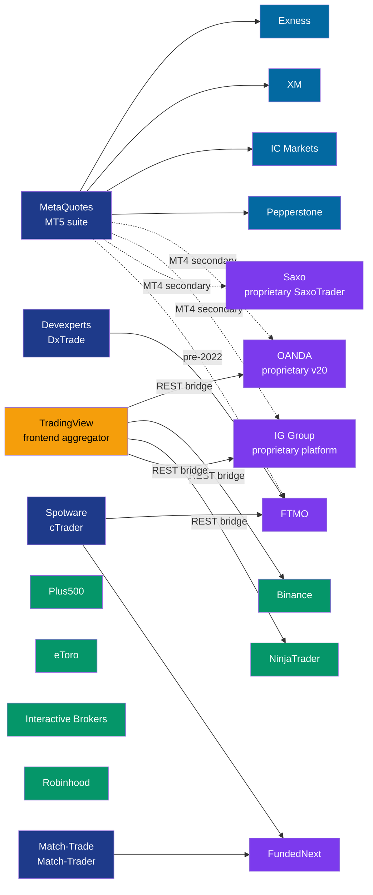

# White Label Relationship Map

"Is this broker's trading platform proprietary or white-labeled?" — the answer to this question defines its technical freedom, operating costs, and user stickiness.

---

## Three Basic Shapes

```
┌─────────────────────────┐   ┌─────────────────────────┐   ┌────────────────────┐
│  A. Pure White Label    │   │  B. Hybrid              │   │  C. Pure Proprietary │
│                         │   │                         │   │                    │
│  Use MetaQuotes /        │   │  Build their own +       │   │  Full-stack in-house │
│  cTrader / Match-Trader  │   │  offer MT4/5 alongside   │   │  matching engine,    │
│  kits, slap a logo,      │   │  (keep legacy users      │   │  terminal, API,      │
│  resell                  │   │  happy)                  │   │  risk all proprietary │
│                         │   │                         │   │                    │
│  Low cost / fast launch /│   │  Big investment but low │   │  Highest investment / │
│  dependent on MetaQuotes │   │  user migration cost    │   │  maximum control     │
│  policy                  │   │                         │   │                    │
└─────────────────────────┘   └─────────────────────────┘   └────────────────────┘
```

---

## A. Pure White Label MT5 / MT4 (The Bulk of Retail FX)

For these brokers, 90% of the trading experience is decided by MetaQuotes. They provide: account registration, deposits, withdrawals, customer service, CRM, risk parameter configuration, liquidity routing, compliance. **The tech stack is MetaQuotes' — they're just the operators**.

| Broker | Regulation | Main Markets | Liquidity Strategy |
|---|---|---|---|
| Exness | CySEC / FSCA | Global | A-book + B-book hybrid |
| XM | CySEC / ASIC | Global | B-book leaning |
| IC Markets | ASIC | APAC / Europe | Claims STP / ECN |
| Pepperstone | ASIC / FCA | APAC / UK | STP / A-book |
| FxPro | CySEC / FCA | Europe | A-book |
| Admiral Markets | FCA / CySEC | Europe | Hybrid |
| Tickmill | CySEC / FCA | Emerging markets | Claims ECN |
| FBS | CySEC | Asia | B-book leaning |
| RoboForex | IFSC | Global | Hybrid |
| HYCM | FCA / CySEC | Middle East | Hybrid |
| OctaFX | CySEC | APAC | B-book leaning |
| AvaTrade | CBI / ASIC | Global | Hybrid |
| ThinkMarkets | ASIC / FCA | APAC | Hybrid |
| HotForex (HFM) | CySEC | Africa / APAC | Hybrid |
| Alpari | IFSC | Russian-speaking / CIS | Hybrid |
| FXTM (ForexTime) | CySEC | Africa / APAC | Hybrid |
| Swissquote | FINMA | High net worth | A-book |

*Plus hundreds of smaller brokers running the same model.*

**Strategic weakness**: every last one of them has a kill switch at MetaQuotes. If MetaQuotes pulls the license one day for regulatory or commercial reasons, these brokers can't switch quickly (users, EA library, ops all refuse to move).

---

## B. Hybrid (Proprietary + MT4/5 Running in Parallel)

Typically **older-established brokers**. The proprietary platform is brand equity, but retail demand forces them to also offer MT4/5.

| Broker | Proprietary Platform | Also Offers MT4/5 | Currently Pushes |
|---|---|---|---|
| **OANDA** | v20 REST API + fxTrade | MT4 (MT5 limited) | v20 API + TradingView integration |
| **IG Group** | IG Web Platform + L2 Dealer | MT4 | IG's own + ProRealTime |
| **Saxo Bank** | SaxoTraderGO / PRO + OpenAPI | MT4 (light) | Saxo's own + TradingView |
| **CMC Markets** | Next Generation + MT4 | MT4 | CMC's own |
| **Dukascopy** | JForex + Dukascopy | MT4 | JForex (Java) primary |
| **FXCM** | Trading Station + MT4 | MT4 | Trading Station |
| **FOREX.com** | FOREX.com Trader + MetaTrader | MT4/5 | Proprietary |
| **Plus500** | Plus500 proprietary | None offered | Plus500 proprietary (exclusive) |
| **eToro** | eToro Web / App | None offered | eToro proprietary (social + copy) |
| **Capital.com** | Capital.com + MT4 | MT4 | Proprietary |

**Plus500 / eToro are special**: never offered MT4/5, fully proprietary + Web experience. **They're the rare successful cases of peeling retail FX / CFD customers away from MT5** — the price being that users can't bring their EAs with them.

---

## C. Pure Proprietary / Fully Independent

### Crypto Exchanges (all of them)
- Binance / OKX / Bybit / Coinbase / Kraken / Bitfinex / Bitstamp / Huobi
- All matching / API / wallet / client code is in-house
- **Reason**: there was no MT5-equivalent suite available to white-label in crypto, so everyone built from scratch
- **Side effect**: every API is different; ccxt and similar aggregation libraries filled the gap

### Futures / U.S. Traditional
- **Interactive Brokers**: TWS Desktop + IBKR Mobile + Client Portal Web + REST/FIX API
- **Charles Schwab**: thinkorswim (acquired from TD Ameritrade 2020)
- **E*Trade**: proprietary platform + Power E*Trade
- **Robinhood**: Web + iOS / Android, Clojure backend
- **Fidelity**: Active Trader Pro
- **TastyTrade**: TastyTrade platform
- **CQG**: CQG Integrated Client (used by futures HFTs)

### Futures-Specific
- **NinjaTrader**: desktop software + NinjaScript (C#) + in-house broker
- **TradingView + AMP / NinjaTrader integration**: TradingView as frontend, futures brokers as matching

### Prop Firms (the new normal after MT5 migration, 2024+)
- **FTMO**: MT4/MT5 + DxTrade + cTrader (multi-platform in parallel, reducing MetaQuotes single-point risk)
- **TopStep**: NinjaTrader primary + TradingView bridge + some MT5 retained
- **FundedNext**: Match-Trader + cTrader
- **Funded Trading Plus**: Match-Trader
- **Earn2Trade**: Match-Trader + NinjaTrader
- **Apex Trader Funding**: Rithmic + NinjaTrader
- **The5ers**: MT4/5 + TradeLocker

---

## TradingView's Unique Position: Frontend White Label vs Backend White Label

Traditional "white label" = I buy the MetaQuotes kit and change the logo.
TradingView's model = **a multi-broker aggregation frontend** — user sees charts on TradingView, order entry is routed to some broker in the backend.

Order path:

```
[TradingView user]
  ↓ log into TradingView, bind broker account
[TradingView frontend]
  ↓ REST API calls
[Broker API layer] (OANDA v20 / Binance / Bybit / AMP / IG / 40+ brokers)
  ↓
[That broker's OMS]
```

**TradingView doesn't match, doesn't custody, doesn't take orders** — it's just frontend UI + community + charts. That role used to belong to the MT5 terminal; now TradingView has taken a large chunk of it.

**Brokers supporting order entry via TradingView reached ~40+ by 2026** (vs ~5 in 2020). This is the quietest but largest migration path away from MT5.

---

## Regulatory Arbitrage View

**White-label MT5 brokers** usually sit in lax-regulation jurisdictions (CySEC / FSCA / IFSC). Reason: strict-regulation jurisdictions (FCA / ASIC) enforce strict rules on leverage and B-book, which squeezes the margin spread in the white-label model.

**Fully proprietary brokers** usually sit in strict-regulation jurisdictions (FCA / ASIC / SEC / FINMA). They have brand equity + compliance investment and can price higher locally.

---

## Prop Firm Tech Stack Migration Snapshot (2024–2026)

| Prop Firm | 2022 | 2024+ | Migration Reason |
|---|---|---|---|
| FTMO | MT5 | MT4/5 + DxTrade + cTrader | MetaQuotes pressure + risk diversification |
| TopStep | MT5 + NinjaTrader | NinjaTrader + TradingView + minor MT5 | Futures business focus |
| FundedNext | MT4/5 | Match-Trader + cTrader | Platform feature fit |
| Funded Trading Plus | MT4/5 | Match-Trader | MetaQuotes license revoked |
| MyForexFunds | MT4/5 | **Shut down by CFTC 2023** | Non-compliance |
| True Forex Funds | MT4/5 | **Ceased operations 2024** | MT5 license revoked |
| E8 Funding | MT4/5 | Match-Trader | Same as above |
| Earn2Trade | NinjaTrader primary | Match-Trader + NinjaTrader | Diversification |

---

## Visualization (Full Graph)



## References

- [Finance Magnates — Broker Directory annual edition](https://www.financemagnates.com/)
- [FXStreet — Best Brokers reviews](https://www.fxstreet.com/brokers)
- [BrokerChooser — 2000+ broker tech stack comparisons](https://brokerchooser.com/)
- [TradingView — Supported Brokers](https://www.tradingview.com/brokers/) — official list, ~40 brokers
- Each prop firm's "Platforms supported" page
- MetaQuotes partner list (partially published sometimes)
