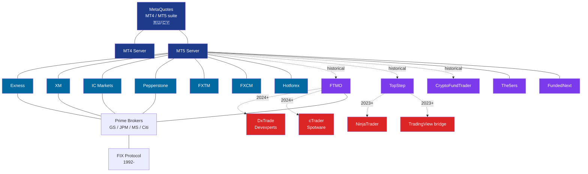
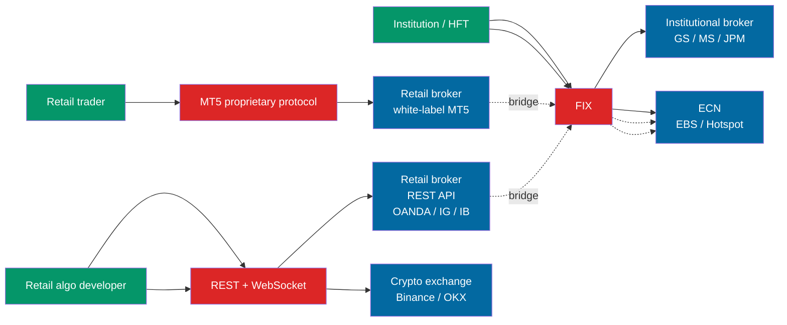
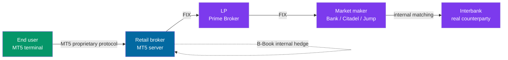
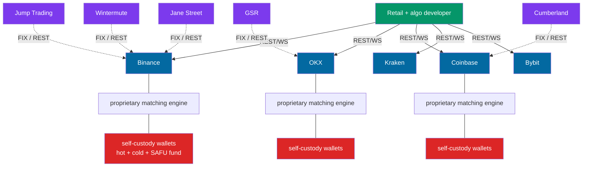
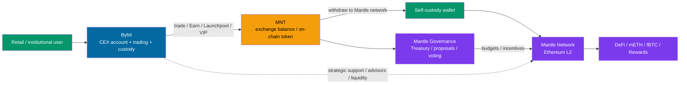
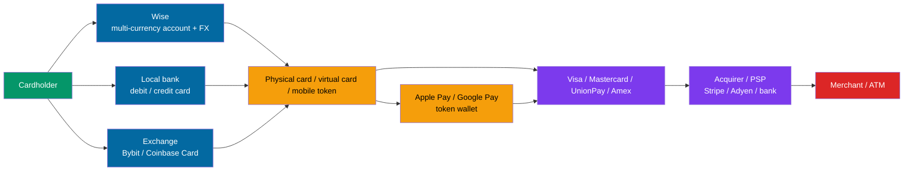
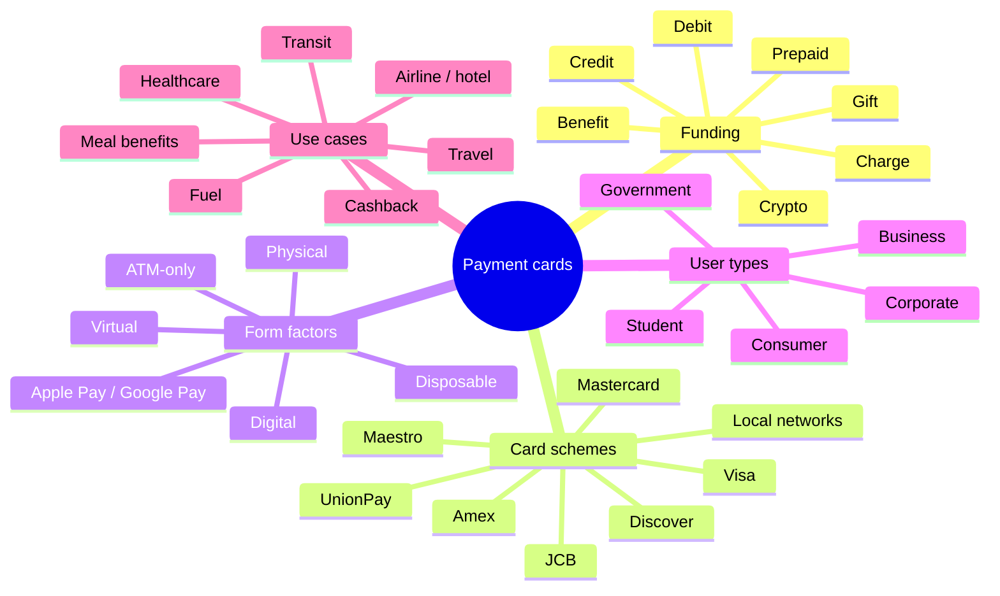
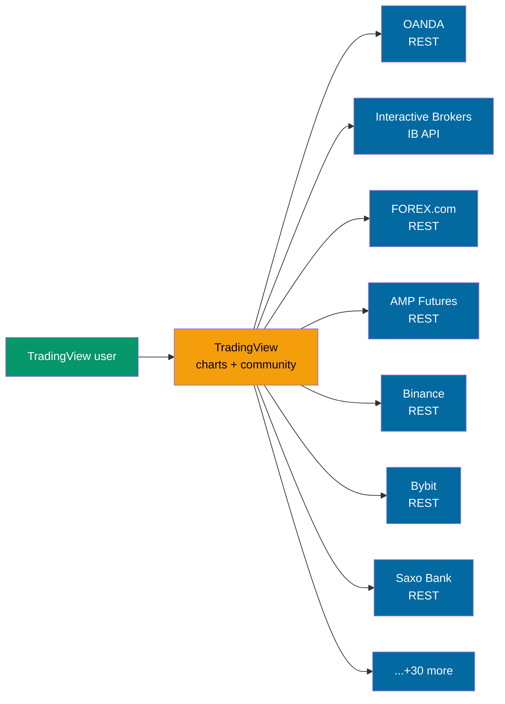
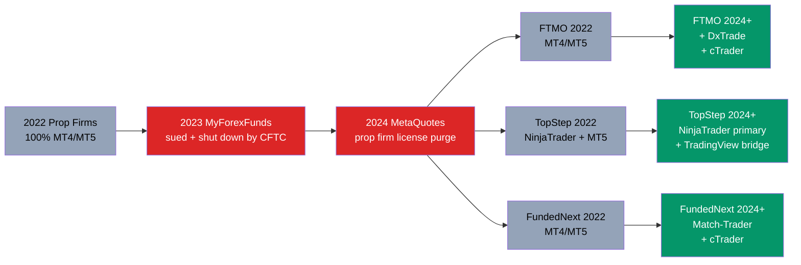

# Trading Platform Relationship Graph (Master Map)

This file uses Mermaid to draw the "ownership / protocol / data flow" relationships between the major players. Open in a Mermaid-capable tool (VS Code, GitHub, Obsidian, Typora) to see the graphs rendered.

## Core Ecosystem: Retail FX + Prop Firms

## Big Picture: Protocol × User Segment

## Liquidity Chain (Retail FX)

## Crypto Track (Completely Different Topology)

## Bybit × Mantle: CEX Distribution into L2

See: [`07-bybit-mantle.md`](./07-bybit-mantle.md)

## Wise Card × Payment Card Stack: App to Card Scheme

See: [`08-wise-card-payment-card-stack.md`](./08-wise-card-payment-card-stack.md)

## Market Card Taxonomy: Funding × Network × Form

See: [`09-card-taxonomy.md`](./09-card-taxonomy.md)

## TradingView's "Multi-Broker Aggregation" Model

TradingView is currently the only platform that can **replace retail traders' habit of placing orders from the MT5 terminal** — it doesn't sell server software to brokers; it connects to broker REST APIs from the browser.

## Prop Firm Tech Stack Migration 2022 → 2026

## Tech Stack Ownership At-a-Glance

| Platform | Owner / HQ | Founded | Business Model |
|---|---|---|---|
| **MetaQuotes** | Cyprus (originally Russia) | 2000 | Sells MT suite to brokers |
| **Spotware** | Cyprus | 2011 | cTrader platform licensing |
| **Trading Technologies (TT)** | Chicago US | 1994 | Futures trading platform |
| **NinjaTrader** | Denver US | 2003 | Futures platform + prop firm infrastructure |
| **TradingView** | London UK | 2011 | Charts + social + broker aggregation |
| **Devexperts** | US/RU | 2002 | DxTrade white-label platform |
| **cTrader Copy** | Cyprus (Spotware sub-brand) | 2013 | Copy trading |
| **Match-Trader** | Sofia BG (Match-Trade parent) | 2013 | Prop-firm-dedicated white-label platform |

## Further Reading

- `01-ownership.md` — detailed ownership trace (incl. SEC / Companies House records)
- `02-liquidity-chain.md` — deep dive on LP chain
- `03-whitelabel-map.md` — which brokers use MT5 / proprietary / hybrid
- `../05-trends/` — how these relationships will shift
