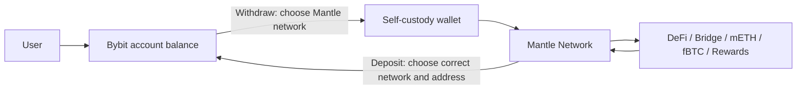

# Bybit × Mantle: Exchange, Layer 2, and the MNT Ecosystem

> Beginner-oriented note: separate Bybit, Mantle, MNT, and BitDAO first, then explain why they are deeply connected. Last checked: 2026-04-23.

---

## One-Line Takeaway

**Bybit is a centralized exchange, Mantle is an Ethereum Layer 2 network, and MNT is the Mantle ecosystem token.** Their relationship is not a simple parent/subsidiary structure. A better model: Bybit was the most important early funding, distribution, and product partner for BitDAO/Mantle, while Mantle evolved out of the BitDAO ecosystem into its own chain and product brand.

Practical mental model:

- **Bybit**: account system + order matching + custody + spot / derivatives / Earn products.
- **Mantle Network**: wallet system + on-chain execution + smart contracts + lower-cost Ethereum L2.
- **MNT**: gas, governance, and incentives on Mantle; tradable and utility-bearing inside Bybit's fee, VIP, campaign, and yield products.
- **BitDAO**: the historical DAO / treasury / governance shell that was consolidated into the Mantle brand through a “One brand, One token” path.

---

## 1. Beginner Mental Model

| Object | What it is | How you use it | Asset control | Main risks |
|---|---|---|---|---|
| Bybit | Centralized exchange | Email / phone / KYC login | Custodial account balance | Platform risk, account restrictions, liquidation, jurisdiction rules |
| Mantle Network | Ethereum Layer 2 blockchain | MetaMask / Rabby / OKX Wallet | Self-custody via private keys | Lost keys, malicious approvals, wrong network, contract bugs |
| MNT | Mantle native token | Trade on Bybit or withdraw on-chain | Can exist as exchange balance or on-chain asset | Volatility, wrong network, token contract confusion |
| Mantle Treasury / Governance | Ecosystem treasury and governance | MNT holders vote through proposals | Treasury spending needs governance authorization | Governance concentration, transparency, budget efficiency |

Analogy:

```text
Bybit = trading desk for buying, selling, and custody
Mantle = highway for on-chain applications
MNT = fuel, voting ticket, and ecosystem asset for that highway
```

---

## 2. Relationship Timeline

| Date | Event | Relationship meaning |
|---|---|---|
| 2021-07 | BitDAO launched; Bybit became one of the core contributors | Bybit's treasury contributions created the earliest capital and distribution link |
| 2022-06 ~ 2022-11 | BitDAO community explored and unveiled Mantle as a modular L2 | Mantle became BitDAO's core productization attempt |
| 2023-02 | BIP-19 passed, funding Mantle testnet and first-year mainnet operations | Mantle moved from idea to DAO-budgeted core product |
| 2023-03 ~ 2023-04 | BIP-20 changed Bybit contributions into a fixed 48-month schedule | One goal was reducing the risk that BIT looked like a Bybit exchange token |
| 2023-05 ~ 2023-07 | BIP-21 / MIP-22 / MIP-23 pushed “One brand, One token” and BIT→MNT | BitDAO and BIT were consolidated into Mantle / MNT |
| 2023-07 | Mantle Network Mainnet Alpha launched | Mantle became a live L2 network |
| 2025-08 | Mantle announced Bybit executives joining as advisors | The relationship continued as strategic ecosystem collaboration |
| 2025-2026 | Bybit rolled out the MNT Program | MNT became embedded in Bybit fees, VIP, campaigns, and payment/yield surfaces |

---

## 3. What Bybit Does

Bybit is the “exchange layer.” Its core job is not on-chain execution; it is matching, custody, risk management, and product packaging.

### Trading

- **Spot**: buy and sell BTC, ETH, MNT, USDT, and other assets.
- **Perpetuals / futures**: leveraged long/short markets with funding-rate mechanics.
- **Options**: more complex derivatives for volatility-aware users.
- **Unified Trading Account**: one account system for spot, derivatives, options, and margin.

### Growth and asset products

- **Earn**: savings, staking, fixed-term, and structured yield products.
- **Launchpad / Launchpool / Megadrop**: token distribution using exchange traffic.
- **Copy Trading / Trading Bots**: packaged trading strategy products.
- **Bybit Card / Pay**: extension of exchange balances into payment and spending use cases.

### MNT inside Bybit

According to Bybit's MNT Program, MNT can be used to:

- Acquire MNT through deposit, spot trading, Convert, DCA, OTC, and other channels.
- Pay certain spot / spot margin / USDT and USDC contract trading fees at a discount.
- Improve VIP asset calculations through the MNT asset multiplier.
- Participate in Launchpool, Launchpad, Megadrop, Token Splash, and other holder benefits.
- Function as a cashback or payment asset in Card / Pay contexts.

Important: **MNT inside a Bybit account is an exchange ledger balance, not an on-chain Mantle position.** It enters on-chain usage only after withdrawal to a self-custody wallet on the correct network.

---

## 4. What Mantle Does

Mantle is the “on-chain execution layer.” It aims to make Ethereum ecosystem transactions cheaper and faster while preserving an EVM-compatible developer environment.

### Network layer

- **Ethereum Layer 2**: Mantle relies on Ethereum/EVM compatibility while moving execution to L2.
- **Modular architecture**: execution, data availability, and finality are separated and upgradable in Mantle's official narrative.
- **Data availability / EigenDA**: Mantle has long positioned EigenLayer / EigenDA integration as a technical differentiator.
- **Bridging**: users can move assets into Mantle through the official bridge or third-party bridges.

### Application layer

Mantle is not only a chain; it also pushes native assets and yield assets:

- **DeFi**: DEXs, lending, liquidity mining, and yield aggregators.
- **mETH Protocol**: Mantle-linked liquid ETH staking/restaking.
- **Ignition fBTC**: wrapped BTC direction for bringing Bitcoin into Web3/DeFi.
- **Stablecoin and RWA yield partnerships**: official materials mention Ethena USDe, Agora AUSD, and Ondo USDY.
- **EcoFund**: ecosystem fund for investing in and incentivizing projects.

### MNT on Mantle

According to Mantle tokenomics:

- **Governance**: each MNT provides voting weight in Mantle Governance.
- **Gas**: MNT is used for gas fees on Mantle Network.
- **Incentives**: MNT is a principal asset in Mantle Rewards Station and ecosystem programs.
- **Treasury management**: MNT held by Mantle Treasury requires governance-approved budget proposals for distribution.

Common addresses:

- **Ethereum L1 MNT**: `0x3c3a81e81dc49A522A592e7622A7E711c06bf354`
- **Mantle L2 MNT**: `0xdeaddeaddeaddeaddeaddeaddeaddeaddead0000`
- **Mantle L2 wMNT**: `0x78c1b0C915c4FAA5FffA6CAbf0219DA63d7f4cb8`

---

## 5. Asset Flow: Bybit to Mantle

The beginner trap: **the same ticker MNT can exist on different ledgers.**



Checklist:

1. **Address**: copy the wallet address; never type it manually.
2. **Network**: confirm whether the MNT withdrawal is on Mantle, Ethereum, or another supported network.
3. **Small test**: send a tiny amount first.
4. **Gas**: on Mantle, you need MNT for gas.
5. **Approvals**: check spender and allowance before connecting to dApps.
6. **Jurisdiction**: Bybit availability changes by region; check the official restricted country list.

---

## 6. Why Bybit Supports Mantle

From the exchange perspective, Mantle gives Bybit three strategic advantages.

### 1. Exchange-token narrative upgrade

BIT was easy to frame externally as a “Bybit exchange token.” BIP-20 explicitly discussed reducing the risk that BIT would be viewed as a centralized exchange token or Bybit token. After BIT→MNT, the narrative shifted from exchange token to L2 ecosystem token.

### 2. CEX traffic into on-chain apps

Bybit has users, fiat rails, spot/perp liquidity, and campaign distribution. Mantle has on-chain applications and ecosystem budget. Together, Bybit can route exchange users into Mantle's DeFi, yield assets, Launchpool, and on-chain campaigns.

### 3. Asset and yield loop

Mantle develops mETH, fBTC, stablecoin yield, EcoFund, and other asset directions. Bybit can plug those assets into trading, collateral, Earn, payments, and institutional services. Mantle's own homepage describes Bybit support as improving liquidity, DeFi-CeFi interoperability, fiat rails, and on-chain/CEX yield connections.

---

## 7. Why Mantle Needs Bybit

For an L2, the hardest problem is not launching a chain. It is distribution:

- Will developers and apps deploy?
- Will users bridge in?
- Will there be stablecoin, ETH, BTC, market-making, and yield assets?
- Will incentives be enough to cold-start usage?
- Will exchanges support deposits, withdrawals, liquidity, and price discovery?

Bybit contributes:

- **Listings and liquidity**: MNT spot/derivatives trading, deposits/withdrawals, and market depth.
- **User distribution**: app placement, campaigns, Launchpool, Megadrop, Earn.
- **Fiat on-ramp**: users can fund on an exchange before withdrawing to Mantle.
- **Institutional surface area**: market makers, VIP, API users, custody, and collateral use cases.
- **Brand visibility**: exchange traffic makes Mantle more visible than most new L2s.

---

## 8. Difference from Binance × BNB Chain

Beginners often call Mantle “Bybit's BNB Chain.” The comparison helps, but it is incomplete.

| Dimension | Binance × BNB Chain | Bybit × Mantle |
|---|---|---|
| Origin | BNB as exchange token and Binance ecosystem asset | BitDAO treasury/governance evolved into Mantle/MNT |
| Chain type | BNB Smart Chain is an independent EVM L1-style chain | Mantle is an Ethereum L2 / modular chain |
| Relationship framing | Historically very tightly bound to Binance ecosystem | Bybit is a major supporter, partner, and advisory resource |
| Token use | BNB for exchange discounts, gas, ecosystem | MNT for Mantle gas/governance and Bybit fee/VIP benefits |
| Decentralization narrative | Exchange ecosystem moving toward community ecosystem | BitDAO community/treasury governance refocused into Mantle product brand |

More precise framing: **Bybit × Mantle is deep coupling between CEX distribution and a DAO/L2 ecosystem, not traditional corporate ownership.**

---

## 9. Beginner Paths

### If you only want to learn

1. Learn CEX, wallet, L1, L2, gas, bridge, and approvals.
2. Watch MNT price and volume on Bybit or CoinGecko.
3. Browse Mantle ecosystem pages without connecting a wallet.
4. Look up a sample MNT transfer in a block explorer.

### If you want to buy MNT

1. Confirm your jurisdiction can legally use Bybit or another compliant exchange.
2. Use spot, not leverage.
3. Decide whether you want to hold/trade or use Mantle on-chain.
4. If holding on an exchange, understand custodial risk.

### If you want to try Mantle

1. Set up a self-custody wallet; back up the seed phrase offline.
2. Withdraw a tiny amount of MNT to Mantle Network.
3. Start with a simple transfer or official bridge action.
4. Gradually explore DEXs, mETH, fBTC, Rewards, and other apps.
5. Avoid unlimited approvals when you do not understand the contract.

### Not recommended for beginners

- High-leverage perpetuals.
- Recursive lending, looping, or cross-chain arbitrage.
- Unknown airdrop links.
- Using VPNs to bypass exchange restrictions.
- Bridging or withdrawing all funds in one transaction.

---

## 10. Risk Checklist

| Risk | Where it appears | Control |
|---|---|---|
| Volatility | Buying or using MNT | No leverage, size positions conservatively |
| Platform risk | Holding MNT on Bybit | Keep only exchange-needed funds on CEX |
| Jurisdiction risk | Using Bybit | Check official restricted countries first |
| Wrong network | Deposits / withdrawals | Confirm network and address, test small |
| Lost keys | Self-custody wallet | Offline seed backup, never share it |
| Contract risk | DeFi, bridges, yield products | Use official links, small size, check audits/TVL |
| Approval risk | dApp connections | Limit allowances, revoke periodically |
| Bridge risk | Cross-chain assets | Prefer official or large bridges, avoid unnecessary bridging |
| Governance risk | Treasury budgets and incentives | Track Mantle Forum, Snapshot, and Treasury Monitor |

---

## 11. Open Tracking Questions

- **Bybit's ongoing MNT support**: whether fee discounts, VIP multipliers, and Launchpool benefits persist.
- **Mantle's technical roadmap**: ZK roadmap, data availability, finality, and security model execution.
- **Mantle Treasury efficiency**: whether EcoFund, budgets, and incentives create real users and developers.
- **MNT distribution**: exchange holdings, treasury holdings, budget wallets, and ecosystem incentives.
- **CeFi-DeFi asset loop**: whether mETH, fBTC, and stablecoin yield assets create real usage across Bybit and Mantle.
- **Regulatory risk**: exchange regional restrictions, token trading availability, and U.S.-related restrictions.

---

## 12. Official Sources

- [Mantle website](https://www.mantle.xyz/)
- [Mantle Network page](https://www.mantle.xyz/network)
- [Mantle Tokenomics](https://docs.mantle.xyz/governance/parameters/tokenomics)
- [BIP-19: Securing the Future with Mantle](https://forum.mantle.xyz/t/passed-bip-19-securing-the-future-with-mantle-a-comprehensive-plan/4533)
- [BIP-20: Adjustments to Bybit Contributions](https://discourse.bitdao.io/t/passed-bip-20-adjustments-to-bybit-contributions-to-the-bitdao-treasury-to-improve-tokenomics-project-focus-and-decentralization/4876)
- [BIP-21: Optimization of Brand, Token, and Tokenomics](https://forum.mantle.xyz/t/passed-bip-21-optimization-of-brand-token-and-tokenomics/5327)
- [Mantle Mainnet Alpha](https://www.mantle.xyz/blog/announcements/mantle-network-mainnet-alpha)
- [Bybit: Introduction to the MNT Program](https://www.bybit.com/en/help-center/article/Introduction-to-the-MNT-Program?category=bcaeae54c20e409dbc)
- [Bybit: FAQ — Paying Trading Fees with MNT](https://www.bybitglobal.com/en/help-center/article/FAQ-Paying-Trading-Fees-with-MNT/)
- [Bybit: Service Restricted Countries](https://www.bybit.com/en/help-center/article/Service-Restricted-Countries/trade/trade/spot/)
- [Mantle: Bybit advisory board announcement](https://group.mantle.xyz/blog/announcements/mantle-welcomes-bybit-luminaries-to-advisory-board)
