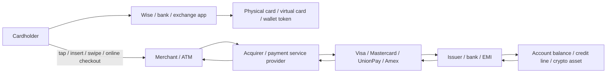

# Wise Card × Debit / Credit / Virtual / Crypto Cards: The Payment Card Stack

> Beginner-oriented note: place the Wise Card inside the broader card payment network, then compare it with debit cards, credit cards, prepaid cards, travel cards, virtual cards, Apple Pay / Google Pay, and crypto cards such as Bybit / Coinbase. Last checked: 2026-04-23.

---

## One-Line Takeaway

**The Wise Card is not a credit card, and it is not Visa / Mastercard itself. It is an international debit/prepaid-style payment card attached to a Wise multi-currency account, running over card networks such as Visa or Mastercard.**

Core mental model:

- **Wise**: account, balances, FX conversion, app, risk controls, and user relationship.
- **Wise Card**: card interface that connects Wise balances to merchants, POS terminals, online checkout, and ATMs.
- **Visa / Mastercard**: card schemes / payment networks; they are not automatically the card issuer.
- **Issuer / banking partner**: region-dependent entity handling card issuance, BIN, compliance, and settlement role.
- **Apple Pay / Google Pay**: not new cards; they tokenize existing cards into a mobile wallet.

Analogy:

```text
Wise account = wallet and FX account
Wise Card = card interface extending that wallet to merchants and ATMs
Visa / Mastercard = card transaction highway
Bank / issuer = licensed card issuance and settlement role
```

---

## 1. Payment Card Stack: Who Does What



Key points:

- **Card product** is not the same as **card scheme**: Wise Card, Revolut Card, and Bybit Card are products; Visa / Mastercard / UnionPay are networks.
- **Issuer** is not always the visible brand: many fintech cards rely on licensed banks, e-money institutions, or BIN sponsors behind the scenes.
- **Merchants connect on the acquiring side**: merchants usually work with Stripe, Adyen, bank acquirers, or local payment processors, not directly with Wise.
- **Card networks route and enforce rules**: Visa / Mastercard handle authorization routing, clearing, dispute rules, and acceptance networks.
- **Funding source determines card type**: Wise balances make it debit/prepaid-like; bank credit lines make it credit; crypto-to-fiat conversion makes it a crypto card.

### Where Visa / Mastercard / UnionPay / Amex Fit

- **Visa / Mastercard**: typical four-party networks connecting cardholder, issuer, merchant, and acquirer; they usually do not directly lend to retail cardholders.
- **UnionPay**: China's most important domestic card scheme and an international acceptance network; overseas usability depends on local merchants, ATMs, acquirers, and issuer settings.
- **American Express**: both a network and often an issuer/merchant relationship owner; official materials emphasize its closed-loop network data and merchant-network capability.
- **Wise / Revolut / Bybit / Coinbase**: card product brands or account platforms, not card schemes themselves.

---

## 2. What the Wise Card Is

The Wise Card is the spending interface for a Wise multi-currency account. Its core value is not rewards; it is **cross-border spending and transparent FX conversion**.

### What the Wise Card can do

- **In-person card spending / contactless**: use it at merchants supporting the relevant card network.
- **Online payments**: pay with card number, expiry, and CVV.
- **ATM withdrawals**: withdraw local cash, subject to free allowances, limits, and overage fees.
- **Multi-currency spending**: if you hold the right currency balance, Wise uses it first; otherwise it converts automatically under Wise's rules.
- **Physical + digital cards**: physical, digital, or virtual card support varies by region.
- **Mobile wallets**: in supported regions, it can be added to Apple Pay / Google Pay.

### What the Wise Card is not

- **Not a credit card**: normally no credit line, no credit-building function, and no traditional revolving interest structure.
- **Not a bank account itself**: the card accesses Wise balances; account features depend on jurisdiction and Wise's local licensing setup.
- **Not a UnionPay card**: in mainland China and similar settings, it generally depends on Visa / Mastercard acceptance and does not replace a domestic UnionPay card.
- **Not a universal travel card**: some merchants, countries, ATMs, deposits, offline transactions, or high-risk categories may fail.
- **Not a crypto card**: Wise does not directly spend BTC / ETH / USDT as card funding balances.

---

## 3. Wise Card vs Other Card Types

For a fuller card taxonomy, see [`09-card-taxonomy.md`](./09-card-taxonomy.md); this section keeps only the comparisons most relevant to Wise.

| Type | Funding source | Examples | Best for | Relationship to Wise Card |
|---|---|---|---|---|
| Bank debit card | Bank checking/current account | Chase / HSBC debit | Domestic spending, salary account, ATM | Similar debit experience, but Wise uses multi-currency Wise balances |
| Credit card | Bank credit line | Visa / Mastercard / Amex credit cards | Deferred payment, rewards, insurance, deposits | Wise Card is not credit; no credit line or rewards-first model |
| Prepaid card | Preloaded funds | Travel prepaid cards, gift cards | Budget control, temporary spending | Wise has prepaid traits, but adds multi-currency account and FX |
| Multi-currency travel card | Multi-currency balance + card | Wise, Revolut, YouTrip | Travel, cross-border spending | Wise is a leading example of this category |
| Virtual card | Digital-only card number | Wise digital card, Revolut virtual card | Online shopping, subscriptions, risk separation | Wise digital cards still run over card networks |
| Mobile wallet card | Tokenized card in phone | Apple Pay, Google Pay | Tap-to-pay, app checkout | Wise Card can be added; Apple Pay is not the issuer |
| Crypto card | Exchange balance or crypto asset conversion | Bybit Card, Coinbase Card, Crypto.com Card | Spending crypto balances, cashback | Same card-network rails, different funding and regulatory risk |
| Business / corporate card | Company account or spend management limit | Brex, Ramp, Wise Business Card | Team expenses, SaaS subscriptions | Wise Business Card emphasizes cross-border and multi-currency spend |
| Local payment card | Domestic scheme and bank account | UnionPay, Interac, EFTPOS | High domestic acceptance | Wise is stronger cross-border; domestic coverage may be weaker |

---

## 4. Wise Card vs Bank Debit Card

### Strengths of bank debit cards

- Strong local ATM and domestic acquiring network coverage.
- Usually connected to salary, rent, bills, loans, and credit history.
- More mature in local consumer-protection and banking frameworks.
- May support local schemes such as UnionPay, Interac, EFTPOS, or Girocard.

### Strengths of the Wise Card

- Clearer multi-currency balances and cross-border FX experience.
- Can reduce opaque foreign-exchange markups from traditional banks.
- Lets users hold currencies such as USD, EUR, GBP, and JPY in advance.
- Useful for freelancers, cross-border income, travel, and foreign online shopping.

### Key difference

```text
Bank debit card = spending interface for a domestic bank account
Wise Card = global spending interface for Wise multi-currency balances
```

If you live mainly in one country, a local bank debit card is core infrastructure. If you frequently travel, shop cross-border, or receive foreign currency, Wise is a useful complement.

---

## 5. Wise Card vs Credit Card

Credit cards and Wise Cards operate on very different logic.

| Dimension | Wise Card | Credit card |
|---|---|---|
| Funding | Existing Wise balance | Bank credit line |
| Borrowing | Usually no | Yes, spend first and repay later |
| Interest | No revolving credit interest | High interest if revolving or late |
| Points / miles | Not the core value | Often a core value |
| Hotel / rental car deposits | May be limited | Usually better suited |
| Building credit history | Usually no | Yes |
| FX transparency | Strong | Depends on bank and scheme fees |

Beginner rule:

- **Budget control / travel / cross-border shopping**: Wise Card is easier to reason about.
- **Points, miles, travel insurance, deposits, purchase protection**: credit cards are stronger.
- **Avoiding debt and interest**: Wise Card is less likely to create revolving debt.

---

## 6. Wise Card vs Revolut / YouTrip / Monzo / N26

These products belong to the same broad category: **fintech multi-currency account + card spending**.

Shared traits:

- App onboarding, card spending, visible exchange rates, and cross-border payments.
- Most support physical cards, virtual cards, Apple Pay / Google Pay.
- Most rely on Visa / Mastercard rails.
- Licensing and protection mechanisms vary by jurisdiction.

Wise's relative position:

- More focused on **cross-border transfers and transparent real FX cost**.
- Stronger remittance routes and local receiving account capabilities.
- Does not center crypto, stock trading, social finance, or high-frequency trading.
- Best fit: “I need multi-currency receiving, conversion, and spending,” not “I want a super-app.”

Revolut / Monzo / N26 often look more like neobanks or broad financial apps, bundling budgeting, investing, crypto, insurance, subscriptions, or family accounts.

---

## 7. Wise Card vs Payoneer Card

Wise and Payoneer both serve cross-border money movement, but their card positioning differs:

| Dimension | Wise Card | Payoneer Card |
|---|---|---|
| Main users | Individuals, freelancers, travel, cross-border life | Cross-border sellers, ad spend, marketplace payouts, B2B payments |
| Funding | Wise multi-currency balances | Payoneer USD / EUR / GBP / CAD balances |
| Card network | Visa / Mastercard depending on region | Mostly Mastercard with a clear commercial-card positioning |
| Typical use | Travel spending, foreign online shopping, daily small payments | Ads, SaaS, inventory, suppliers, company expenses |
| Fee structure | Transparent FX and ATM rules | Commercial card fees, annual fees, cross-border and FX fees depend on account |

Simple rule:

```text
Wise is closer to “cross-border fiat account + card for individuals and small teams.”
Payoneer is closer to “commercial payout account + card for cross-border sellers and platforms.”
```

If your income comes from Amazon, TikTok, Upwork, ad spend, or B2B marketplaces, Payoneer's commercial-card positioning may fit better. If your main need is travel, study abroad, foreign online shopping, freelance income, and FX conversion, Wise is usually easier to understand.

---

## 8. Wise Card vs Crypto Exchange Cards

Bybit Card, Coinbase Card, and Crypto.com Visa Card are a different category: **exchange / crypto balances connected to traditional card networks**.


| Dimension | Wise Card | Crypto exchange card |
|---|---|---|
| Funding | Fiat multi-currency balances | Crypto assets, stablecoins, or exchange fiat balances |
| Main value | FX, cross-border payments, transparent fees | Spend crypto, cashback, exchange benefits |
| Risks | Availability, account review, FX fees | Exchange risk, volatility, tax records, regulatory change |
| Tax complexity | Relatively lower | Each spend may create asset-disposal records |
| Beginner friendliness | Higher | Depends on crypto and tax understanding |

Key distinction: **Wise Card makes fiat money more cross-border; crypto cards package crypto assets into fiat spending.**

---

## 9. Physical, Virtual, Digital, and Mobile Wallet Cards

These are not mutually exclusive types. They are different wrappers around card credentials:

| Name | Essence | Typical use |
|---|---|---|
| Physical card | Plastic card with chip / magstripe / NFC | In-person spending, ATMs |
| Digital card | Card details shown in the app | Immediate online spending |
| Virtual card | Independently generated / replaceable card number | Subscriptions, online shopping, risk segmentation |
| Single-use virtual card | Card number changes per transaction | Higher-risk merchant trials |
| Apple Pay / Google Pay | Tokenized card in a mobile wallet | Tap-to-pay, in-app checkout |

Wise digital / virtual cards and physical cards still sit behind the same account system. Apple Pay / Google Pay replace the card number with a device token for convenience and security; they do not determine FX rate, fees, or card eligibility.

---

## 10. Common Misconceptions in China / Asia

> Exact availability depends on Wise and local regulation; this section explains mechanisms, not account-opening advice.

- **Having a Wise Card does not mean having a local Chinese bank card**: it does not replace UnionPay debit infrastructure.
- **A Visa / Mastercard logo does not mean universal acceptance**: many mainland China merchants rely on Alipay, WeChat Pay, UnionPay, and local acquiring.
- **ATM usability can vary**: it depends on the ATM, international network support, and issuer restrictions.
- **Deposit scenarios can be tricky**: hotels, rental cars, gas stations, and offline pre-authorizations may not like debit/prepaid-style cards.
- **Wise service coverage changes**: card eligibility, delivery, balances, fees, and mobile wallet support vary by country/region.

---

## 11. Beginner Decision Guide

### If you mostly live in one country

- Local bank debit card + a suitable credit card is the foundation.
- Wise Card is a cross-border shopping, travel, and receiving complement.

### If you travel or shop internationally

- Wise Card is useful for pre-converting currency, holding multi-currency balances, and daily spending.
- Credit cards are stronger for hotels, rental cars, rewards, insurance, and high-value purchase protection.

### If you receive foreign-currency income

- Wise is useful for receiving, converting, transferring, and spending foreign currency.
- Local bank accounts remain important for taxes, salary, loans, and long-term savings.

### If you hold crypto

- Crypto cards help connect exchange assets to everyday spending.
- Each spend can involve asset sale, tax records, exchange controls, and regulatory risk.
- Wise Card is not for directly spending crypto assets.

---

## 12. Risk Checklist

| Risk | Where it appears | Control |
|---|---|---|
| Regional unavailability | Applying for Wise or exchange cards | Check official supported countries first |
| Fee misunderstanding | Cross-currency spending, ATM withdrawal | Read Wise fee and ATM allowance pages |
| Merchant rejection | Deposits, offline transactions, high-risk merchants | Carry backup credit/local card |
| FX volatility | Pre-conversion or automatic conversion | Convert in smaller batches; do not mix payment tools with speculation |
| Account review | Large cross-border flows | Keep source-of-funds documents and invoices |
| Card fraud | Online shopping, subscriptions, lost card | Use virtual cards, spending limits, instant freeze |
| Tax record complexity | Crypto card spending | Track each asset disposal and cost basis |
| Network limitation | Specific country / ATM / merchant | Carry a second network card, e.g. Visa + Mastercard / local card |

---

## 13. Relationship Summary

```text
The Wise Card is not “another Visa.” It is Wise's product that connects multi-currency balances to Visa / Mastercard rails.

Bank debit cards solve domestic everyday payments.
Credit cards solve credit, rewards, and deposits.
Wise Card solves cross-border fiat spending and FX.
Revolut / N26 / Monzo solve neobank app experience.
Bybit / Coinbase / Crypto.com cards solve crypto-to-spend access.
Apple Pay / Google Pay solve tokenized mobile payments.
Visa / Mastercard / UnionPay / Amex solve global or local card-network routing.
```

---

## 14. Official Sources

- [Wise Card](https://wise.com/card/)
- [Wise Help: What are the Wise card fees?](https://wise.com/help/articles/2935769/what-are-the-wise-card-fees)
- [Wise Help: Getting a Wise card](https://wise.com/help/articles/2968915/can-i-get-the-wise-card-in-my-country)
- [Wise Help: Spending abroad with your card](https://wise.com/help/articles/2935771/how-do-i-use-my-wise-card-abroad)
- [Wise: Virtual Card](https://wise.com/us/virtual-card/)
- [Wise Help: Apple Pay / Google Pay](https://wise.com/help/articles/2978018/can-i-use-my-wise-card-with-apple-pay-or-google-pay)
- [Visa: Accept Visa payments](https://usa.visa.com/run-your-business/accept-visa-payments.html)
- [Mastercard: How payments work](https://www.mastercard.us/en-us/business/overview/payment-processing.html)
- [UnionPay International](https://www.unionpayintl.com/en/)
- [American Express Global Network](https://network.americanexpress.com/globalnetwork/v4/partners/acquirers/power-of-the-network/)
- [CFPB: Prepaid cards](https://www.consumerfinance.gov/consumer-tools/prepaid-cards/)
- [Payoneer Commercial Mastercard](https://www.payoneer.com/solutions/payoneer-commercial-card/)
- [Bybit Card](https://www.bybit.com/en/help-center/article/Bybit-Card-Introduction)
- [Coinbase Card](https://help.coinbase.com/en/coinbase/trading-and-funding/coinbase-card/coinbase-card-for-the-us)
- [Crypto.com Visa Card](https://www.crypto.com/cards/)
