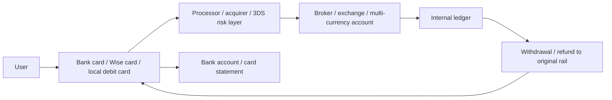

# Wise Card × Trading Platform Funding Rails: Bank Cards, Card Schemes, and Trading Accounts

> This page keeps only what matters for this project: how cards serve brokers, crypto exchanges, cross-border payout accounts, and trading platforms in deposits, withdrawals, FX, and spend-card retention. Last checked: 2026-04-23.

---

## One-Line Takeaway

**From a trading-platform perspective, a card is not just a consumer spending tool. It is a high-conversion, high-fee, high-fraud-risk funding and withdrawal rail.**

More precisely:

- **Wise Card**: closer to a cross-border fiat account interface, useful for multi-currency receipt, conversion, spending, and small-scale treasury movement.
- **Bank debit / credit cards**: one of the most common retail fiat funding rails, but with large differences in fraud, refunds, and availability.
- **Visa / Mastercard / UnionPay**: routing and rules layers, not the trading platform itself.
- **Exchange / broker cards**: not a funding rail, but a retention product that repackages platform balances into spendable balances.

What this project actually cares about is not “which card has the best cashback,” but:

```text
how users fund trading accounts with fiat
how platforms manage chargebacks and fraud
why card funding is fast but expensive
why withdrawals often return to the original card
why Wise / Payoneer / local debit cards play different roles around trading platforms
```

---

## 1. Why Trading Platforms Care About Cards

For trading platforms, cards serve four core roles.

### 1) Acquisition rail

- For first-time retail funding, **debit / credit cards** are often the easiest method.
- Cards reduce friction versus wire transfers or ACH settlement delays.
- This matters especially for crypto exchanges: users can buy crypto first, then start trading immediately.

### 2) Faster usable funds

- Coinbase has long positioned **debit card purchase** as a faster path to usable funds.
- Bybit pushes bank-card purchase inside One-Click Buy.
- This matters for users who want to open positions quickly.

### 3) Refund path and return-to-source

- eToro explicitly states that if you funded with a debit card, withdrawal will usually first be processed as a **refund to the original payment method**.
- That is not just UX design; it is a payments-compliance and AML-control pattern.

### 4) Retention and walletization

- Robinhood Cash Card, Coinbase Card, and Bybit Card are not primarily about inbound funding.
- They extend platform balances into daily spending and cash-management behavior.
- In business terms, they turn a trading account into a stickier money account.

---

## 2. The Card Payment Chain Inside a Trading Platform



The platform does not mainly care about “payment success.” It cares about:

- Is the payment **reversible**?
- Can it later become a **chargeback**?
- Will the issuer or scheme classify it as **high-risk / quasi-cash**?
- When can the platform safely release the funds for trading or off-platform withdrawal?

---

## 3. Three Main Card Roles Around Trading Platforms

| Role | Typical products | Meaning inside trading platforms |
|---|---|---|
| Funding cards | Bank debit cards, credit cards, local debit rails | Move fiat into the trading account |
| Cross-border account cards | Wise, Payoneer, Revolut Business | Support multi-currency receipt, treasury movement, and cross-border flows |
| Platform spend cards | Coinbase Card, Bybit Card, Robinhood Cash Card | Turn platform balances into spendable balances and improve retention |

These should not be collapsed into one category.

---

## 4. Where the Wise Card Fits

Wise matters to this project not because it is a “good travel card,” but because it sits between **bank-account alternative, cross-border payout tool, and payment card**.

### Why Wise matters in platform-adjacent finance

- **Multi-currency balances**: useful for USD, EUR, GBP, and other fiat routing.
- **Transparent FX**: attractive for traders, freelancers, creators, and distributed teams.
- **Card + account bundle**: receipt, conversion, and spending in one stack.
- **Small cross-border treasury**: lighter than traditional international banking for many users.

### What Wise is not

- Not the core clearing account of a broker or exchange.
- Not a card scheme.
- Not the custody layer for securities or crypto assets.
- Not the final solution for large institutional treasury movement.

In one sentence:

```text
Wise is better understood as a cross-border fiat tool around trading platforms,
not as core trading, clearing, or custody infrastructure.
```

---

## 5. Wise Card vs Bank Debit Card for Trading Funding

| Dimension | Wise Card | Bank debit card |
|---|---|---|
| Underlying account | Multi-currency fintech account | Bank checking/current account |
| Trading-platform acceptance | Inconsistent; depends on platform and acquiring rules | Higher, especially in domestic markets |
| Main advantage | Cross-border FX and multi-currency balances | Clearer domestic funding, withdrawal, and refund path |
| Main limitation | Merchant-category, region, and platform risk rules may block it | FX markups, cross-border card failure, international fees |
| Best fit | Cross-border life, international ops, auxiliary funding | Primary local funding rail |

For trading-platform users:

- **Local bank debit card** is closer to the main funding weapon.
- **Wise Card** is closer to an auxiliary cross-border tool.

---

## 6. Wise vs Payoneer in Platform Money Movement

| Dimension | Wise | Payoneer |
|---|---|---|
| Typical user | Individuals, freelancers, cross-border life | Cross-border sellers, marketplace payouts, ad spend, B2B |
| Main value | Receiving + FX + multi-currency spending | Marketplace payout + business payments + commercial card |
| Meaning for trading platforms | Individual-level cross-border fiat movement | Business-level payout and seller/payment stack |
| Card positioning | Account-attached spend card | More clearly commercial spend card |

From the perspective of platform-adjacent finance:

- **Wise** is closer to trader / freelancer / small operator use.
- **Payoneer** is closer to seller / affiliate / business operator use.

---

## 7. Why Platforms Often Prefer Debit Over Credit

Credit cards are not always “better” for trading platforms. Often they are harder.

### Reason 1: cash advance / quasi-cash risk

Bybit's Bank Card Terms explicitly warn that if you use a **credit card** to purchase crypto, your issuer may classify it as a **cash advance**.

That means:

- the user may face high cash-advance fees;
- the issuer is more likely to block the transaction;
- the platform may see higher failure and dispute rates.

### Reason 2: greater chargeback exposure

Card funding is fundamentally reversible.

For the platform:

- bank transfers are harder to reverse once settled;
- credit-card funding is more exposed to cardholder disputes and chargebacks;
- if crypto has already been delivered and the card payment is reversed, the platform eats the loss.

### Reason 3: regional compliance restrictions

Different countries treat “credit card purchase of securities / crypto / CFDs” differently.

So many platforms end up with rules such as:

- debit cards only, no credit cards;
- only certain countries or issuer BINs;
- only cards that support 3D Secure.

---

## 8. Why Withdrawals Often Go Back to the Original Card

This is one of the most financial, least intuitive pieces of the topic.

eToro's official FAQ states that:

- the platform may return funds to the payment method originally used for deposits;
- if a debit card funded the account, withdrawal will usually first be processed as a **refund**.

The financial logic is:

### 1) AML and source-of-funds control

The platform wants to prove:

- where the money came from;
- where it goes back;
- that the path matches the identity of the account holder.

### 2) Scheme and acquirer rules

In many card contexts, refunding the original transaction rail is more compliant than paying out to a new arbitrary card.

### 3) Fraud control

If the platform allows “any card in, any bank account out,” it becomes easier to exploit for laundering and stolen-card flows.

So the common logic becomes:

```text
refund the original funding source first
then pay profit or excess proceeds through bank transfer or backup withdrawal rails
```

---

## 9. Platform Cards Are a Different Business Line

These cards are not primarily inbound-funding tools. They turn platform balances into spendable balances.

| Platform card | Underlying funds | Business purpose |
|---|---|---|
| Coinbase Card | available crypto or USD balance | make trading-account balances spendable |
| Bybit Card | exchange assets / fiat or stablecoin balance | improve walletization and retention |
| Robinhood Cash Card | Robinhood Spending Account balance | extend broker app into a cash-management account |

Robinhood's own materials are explicit:

- Robinhood Cash Card is issued by **Sutton Bank**;
- it is tied to a **spending account**, not directly to trading itself.

Commercially, these cards matter because they:

- raise daily engagement;
- keep more balances inside the platform;
- move the platform from “trading app” toward “wallet / money account.”

---

## 10. What Is In Scope for This Project

### High relevance

- Bank debit / credit cards as retail funding rails.
- Wise / Payoneer / Revolut Business as cross-border fiat tools.
- Exchange / broker spend cards as retention products.
- Visa / Mastercard / UnionPay as card-routing layers.
- Local debit networks because they shape domestic deposit success rates.

### Medium relevance

- Business / corporate cards for platform operating expenses, ad spend, and SaaS.
- ATM networks where cash access and regional acceptance matter.

### Low relevance / mostly out of scope

- Campus cards, gift cards, gaming cards, meal cards, transit cards.
- They are real card types, but not a core part of the trading-platform atlas thesis.

---

## 11. The Financial Nature of Card Rails in Trading

For trading platforms, card rails are fundamentally:

```text
high-conversion acquisition rails
+ high payment cost
+ high chargeback risk
+ strong geographic dependence
+ strong compliance dependence
```

That is why platforms usually converge on a mix like:

- **retail funding**: cards + bank transfer + local wallets + P2P + third-party pay-ins;
- **larger tickets**: bank transfer dominates;
- **instant access**: debit card is favored;
- **retention**: the platform later issues its own debit/spend card.

---

## 12. Conclusion

From this project's perspective:

- **Wise Card** should not be framed as a generic travel card. It belongs in the **cross-border fiat funding layer**.
- **Bank cards** are not merely spending tools; they are one of the most important retail funding rails in trading.
- **Visa / Mastercard / UnionPay** are rule-and-routing layers that platforms must integrate with.
- **Broker / exchange cards** are extensions of balance walletization and retention strategy.

If you remember one line:

```text
Inside trading platforms, cards are funding rails first and consumer spend tools second.
```

---

## 13. Official Sources

- [Wise Card](https://wise.com/card/)
- [Bybit — How to Buy Coins with Your Bank Card](https://www.bybit.com/en/help-center/article/How-to-Buy-Coins-with-Your-Credit-Debit-Card-on-Bybit)
- [Bybit — FAQ Bank Card Payments](https://www.bybit-global.com/en/help-center/article/FAQ-Bank-Card-Payments)
- [Bybit — Bank Card Terms of Use](https://www.bybit.com/en/help-center/article/?id=000001639)
- [eToro — Deposit FAQ](https://www.etoro.com/en-us/customer-service/deposit-faq/)
- [eToro — Withdraw FAQ](https://www.etoro.com/en-us/customer-service/withdraw-faq/)
- [Coinbase — Using a bank account as a payment method](https://help.coinbase.com/en/pro/getting-started/adding-a-payment-method/using-a-bank-account-as-a-payment-method-for-us-customers)
- [Coinbase — Add a payment method troubleshooting](https://help.coinbase.com/en/coinbase/getting-started/add-a-payment-method/add-a-payment-method-troubleshooting)
- [Coinbase Card — Use your Coinbase debit card](https://help.coinbase.com/coinbase/trading-and-funding/coinbase-card/use-cb-card)
- [Robinhood — Robinhood Cash Card](https://robinhood.com/us/en/support/articles/robinhood-cash-card/)
- [Robinhood — What’s a spending account?](https://robinhood.com/support/articles/what-is-a-robinhood-spending-account/)
