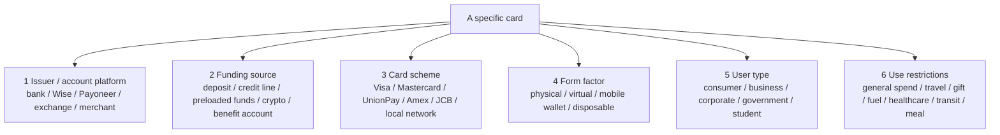

# Taxonomy of Common Market Cards

> This page does not list every card issued by every bank. It gives a complete classification framework for cards: by funding source, card scheme, form factor, cardholder type, regional network, and special-purpose use case. Last checked: 2026-04-23.

---

## One-Line Takeaway

**A “card” is not one thing; it is a bundle of labels across multiple layers.** A specific card usually combines:

```text
issuer / account platform + funding source + card network + form factor + user type + jurisdiction rules
```

Examples:

- **Wise Mastercard debit card** = Wise account + Wise multi-currency balance + Mastercard network + physical/virtual card.
- **Chase Visa credit card** = Chase issuance + bank credit line + Visa network + consumer credit card.
- **Payoneer Commercial Mastercard** = Payoneer account + business balance + Mastercard network + commercial spend card.
- **Bybit Card** = crypto exchange account + fiat/crypto balance conversion + Visa/Mastercard network + crypto spend card.
- **UnionPay debit card** = Chinese bank account + current account balance + UnionPay network + domestic debit card.

---

## 1. The Six-Layer Structure of a Card



Do not judge a card only by its logo. Ask:

1. **Who issued it?**
2. **Where does the money come from?**
3. **Which network routes the transaction?**
4. **Can it be used online / in person / at ATMs / in Apple Pay?**
5. **Is it a consumer, business, corporate, government, or benefit card?**
6. **Does it have merchant-category, country, or currency restrictions?**

---

## 2. By Funding Source

This is the most important classification because it tells you whether you are spending your own money, borrowing from a bank, or spending preloaded/special-purpose funds.

| Type | Funding source | Examples | Core traits | Main risks |
|---|---|---|---|---|
| Debit card | Bank checking/current account balance | Chase Debit, HSBC Debit | Directly debits account balance; ATM access | Insufficient funds, fraud, FX fees |
| Credit card | Bank credit line | Visa / Mastercard / Amex credit cards | Spend first, repay later; rewards/installments | High interest, late fees, overspending |
| Charge card | Short-term issuer credit, usually full payment due | Traditional Amex charge cards | Not typical revolving credit; strong travel/business use | Full repayment required; higher fees |
| Prepaid card | Funds loaded in advance | Travel prepaid cards, reloadable cards | Does not require bank account or credit | Complex fees; protections may be weaker |
| Gift card | Fixed prepaid value | Amazon / Apple / mall gift cards | Gifts, merchant-specific or multi-merchant spend | Expiry, loss, scams |
| Payroll card | Employer payroll funds | U.S. payroll cards | Wage payment for unbanked employees | ATM and balance inquiry fees |
| Government benefit / EBT card | Government benefit funds | SNAP / EBT, subsidy cards | Purpose-restricted public benefits | Category restrictions, eligibility review |
| Healthcare account card | HSA / FSA funds | U.S. HSA/FSA debit cards | Tax-advantaged healthcare spending | Non-qualified use corrections/tax issues |
| Crypto card | Exchange balance, stablecoin, or crypto conversion | Bybit / Coinbase / Crypto.com Card | Packages crypto into card spending | Tax complexity, volatility, exchange risk |
| Multi-currency balance card | Fiat balances in multiple currencies | Wise / Revolut / YouTrip | Cross-border spend and FX | Availability, ATM/deposit limitations |

---

## 3. By Card Scheme / Payment Network

Card schemes route transactions, authorization, clearing, dispute rules, and acceptance. They are not always the issuer or lender.

| Network / brand | Main region | Common card types | Notes |
|---|---|---|---|
| Visa | Global | Debit, credit, prepaid, business | Major four-party network; very broad acceptance |
| Mastercard | Global | Debit, credit, prepaid, business | Similar to Visa; also owns Maestro/Cirrus legacy networks |
| Maestro | Europe / legacy debit | Debit cards | Mastercard debit brand; many markets have been migrating to Mastercard Debit |
| Cirrus | Global ATM network | ATM / debit cash withdrawal | Mastercard ATM network, not the same as full purchase acceptance |
| Visa Plus | Global ATM network | ATM / debit cash withdrawal | Visa ATM network |
| UnionPay | China + global acceptance | Debit, credit, prepaid | Very strong domestic Chinese coverage; overseas acceptance varies |
| American Express / Amex | Global premium/travel strength | Credit, charge, business | Often described as closed-loop / three-party, but also has partner issuance |
| Discover | U.S.-heavy, global through Discover Global Network | Credit, debit, prepaid | Diners Club sits within its global network ecosystem |
| Diners Club | Travel/business international network | Credit, charge | Historic travel card brand, now commonly tied to Discover network |
| JCB | Japan strong, Asian travel network | Credit, debit, prepaid | Strong in Japan and common in Asian travel corridors |
| RuPay | India | Debit, credit, prepaid | Indian domestic card network from NPCI |
| Interac | Canada | Debit / local payments | Canadian domestic debit network |
| eftpos | Australia | Debit / local payments | Australian domestic card network |
| girocard | Germany | Debit / local payments | German domestic bank card network |
| Cartes Bancaires / CB | France | Debit / credit co-badged | French domestic card network, often co-badged with Visa/Mastercard |
| Bancontact | Belgium | Debit / local payments | Strong Belgian local network |
| Dankort | Denmark | Debit / local payments | Danish domestic network, often co-badged with Visa |
| mada | Saudi Arabia | Debit / local payments | Saudi domestic payment network |
| Mir | Russia | Debit / local payments | Geopolitical and sanctions constraints; limited international acceptance |
| Elo | Brazil | Credit / debit / prepaid | Brazilian domestic card brand |
| Troy | Turkey | Debit / credit / prepaid | Turkish domestic card network |

Key distinction:

```text
Visa / Mastercard / UnionPay / Amex = transaction network
bank / Wise / Payoneer / Bybit = account and card provider
Debit / Credit / Prepaid = funding source
```

---

## 4. By Form Factor

| Form | Essence | Typical use | Notes |
|---|---|---|---|
| Physical card | Plastic/metal card with chip, magstripe, NFC | In-person spend, ATM | Loss and theft risk |
| Virtual card | Digital-only card number | Online shopping, SaaS, subscriptions | Cannot insert card or use ATM |
| Digital card | App-generated or app-displayed card details | Immediate online payment | Boundary with virtual card varies by product |
| Disposable card | Card number changes per transaction or short period | Risky merchants, trials | Refunds and recurring billing can be harder |
| Tokenized mobile wallet card | Apple Pay / Google Pay / Samsung Pay token | Tap-to-pay, in-app checkout | Wallet is not the issuer |
| Wearable payment card | Watch/band/ring token | Sports, transit, quick pay | Depends on device and regional support |
| ATM-only card | Cash withdrawal / balance inquiry only | Legacy bank ATM cards | Not general-purpose spend cards |
| Contactless-only / transit card | NFC transit or small-value payment | Metro, buses, campus | Usually closed or semi-closed loop |

---

## 5. By Cardholder and Account Type

| Type | For whom | Examples | Traits |
|---|---|---|---|
| Consumer card | Individuals | Regular debit/credit, Wise, Revolut | Everyday spend, travel, online shopping |
| Student card | Students | Student credit cards, campus cards | Lower limits, education/identity linked |
| Teen / kids card | Minors and families | GoHenry, Revolut <18 | Parental controls, limits, education |
| Business card | Sole proprietors and small companies | Wise Business, Payoneer, Amex Business | Company spend, employee cards, accounting |
| Corporate card | Mid-market and enterprise | Brex, Ramp, Airwallex, bank corporate cards | Spend controls, approvals, reconciliation |
| Purchasing card / P-card | Procurement teams | Bank P-cards | B2B procurement and MCC restrictions |
| Fleet / fuel card | Logistics and fleets | WEX, Shell Fleet | Fuel, maintenance, driver controls |
| Government / benefit card | Public program recipients | EBT, subsidy cards | Purpose-restricted funds |
| Store / private-label card | Merchant customers | Amazon, Costco, department-store cards | Strong merchant benefits but narrow usage |

---

## 6. By Use Case

| Use-case card | Examples | Problem solved | Limitations |
|---|---|---|---|
| Travel card | Wise, Revolut, YouTrip | Multi-currency, lower FX cost, overseas spend | Deposits and ATM rules matter |
| Airline / hotel co-branded card | Amex Platinum, Chase Sapphire, airline cards | Miles, hotel benefits, insurance | High annual fees, complex rewards |
| Cashback card | Citi Double Cash, Apple Card | Simple cash back | Category and cross-border rules vary |
| Balance transfer card | 0% APR balance-transfer cards | Reduce credit-card interest | Transfer fee; high APR after promo |
| Secured credit card | Deposit-backed credit cards | Build/rebuild credit | Deposit required, low limits |
| Store / private-label card | Merchant-issued cards | In-store financing and rewards | Merchant/ecosystem restricted |
| Gift card | Retailer or network gift cards | Gifts and budget separation | Scam-prone; refunds can be hard |
| Transit card | Oyster, Octopus, Suica | Transit and small-value payments | Regional/ecosystem limits |
| Campus card | University cards | Dining, access, printing | Campus closed loop |
| Meal / voucher card | Meal benefit cards, Sodexo-style cards | Employee meal benefits | Merchant-category restrictions |
| Healthcare card | HSA / FSA cards | Tax-advantaged healthcare spending | Qualified medical uses only |
| Gaming / teen spending card | Gaming or family-controlled cards | Limits and parental control | Narrower acceptance |
| Crypto card | Bybit / Coinbase / Crypto.com | Daily spend from crypto assets | Tax and regulatory complexity |

---

## 7. By Issuer Type

| Issuer type | Examples | What they actually provide |
|---|---|---|
| Traditional bank | Chase, HSBC, ICBC, CMB | Deposit accounts, credit lines, compliance, card issuance |
| Card company / network issuer | Amex, Discover | Network, issuance, merchant network, rewards |
| Fintech / neobank | Wise, Revolut, N26, Monzo, Chime | App UX, account packaging, FX, budgeting |
| Cross-border payout platform | Payoneer, Airwallex | Multi-currency receiving, B2B payments, commercial cards |
| Crypto exchange | Bybit, Coinbase, Crypto.com | Crypto balances, fiat conversion, cashback benefits |
| Merchant / platform | Amazon, Apple, Costco | Ecosystem rewards, membership binding, closed-loop spend |
| Government / employer / school | EBT, payroll, campus card | Purpose-specific fund distribution and controls |
| BIN sponsor / issuer processor | Marqeta, Lithic, Adyen Issuing | Card issuing, authorization processing, compliance interfaces |

Many modern cards look like:

```text
front-end brand (Wise / platform X)
+ licensed issuer or EMI
+ BIN sponsor / issuer processor
+ Visa / Mastercard network
+ acquirer / merchant
```

The visible brand is not always the legal issuing bank.

---

## 8. Open-Loop, Closed-Loop, Semi-Closed-Loop

| Type | Meaning | Examples |
|---|---|---|
| Open-loop card | Accepted across broad card networks | Visa / Mastercard / UnionPay cards |
| Closed-loop card | Accepted only in one merchant/ecosystem | Starbucks Card, campus card, some gift cards |
| Semi-closed-loop card | Accepted by a set of merchants/categories | Meal cards, transit cards, mall cards |

Wise Card, bank credit cards, and Bybit Card are usually open-loop. Starbucks cards, single-merchant gift cards, and campus cards are closer to closed-loop.

---

## 9. Practical Beginner Selection Framework

### Domestic everyday life

- Local bank debit card: salary, bills, ATM, baseline daily payments.
- Local credit card: credit history, rewards, deposits, purchase protection.
- Mobile wallet: tokenizes local cards for convenience.

### Travel / international shopping

- Wise / Revolut / YouTrip: multi-currency and FX.
- One Visa + one Mastercard: reduces single-network failure risk.
- Credit card: hotels, rentals, deposits, insurance.

### Cross-border income / freelancing

- Wise: individual and small-team cross-border receiving, FX, spending.
- Payoneer: marketplace payouts, cross-border sellers, ad spend, business expenses.
- Local bank account: taxes, long-term savings, local compliance.

### Business spending

- Business card: small-company and sole-proprietor expenses.
- Corporate card: team approvals, limits, reimbursements, SaaS management.
- P-card / fleet card: procurement and fleet-specific controls.

### Crypto asset spending

- Exchange cards: connect exchange balances to daily spend.
- Stablecoin cards: reduce volatility but keep exchange/regulatory risk.
- Tax records: each spend can be an asset disposal event.

---

## 10. How to Read Card Logos

A card face may show multiple logos:

```text
bank / Wise / Payoneer / exchange logo = account and customer relationship
Visa / Mastercard / UnionPay / Amex / JCB = acceptance network
Debit / Credit / Prepaid / Business = funding and product type
contactless logo = NFC support
Apple Pay / Google Pay = mobile wallet eligibility
Plus / Cirrus = ATM network marks
local scheme logo (CB / girocard / Interac / eftpos) = domestic acquiring network
```

Examples:

- **Wise + Mastercard Debit**: Wise multi-currency balance, Mastercard debit network.
- **Bank + Visa Credit**: bank credit line, Visa network.
- **Bank + girocard + Mastercard**: German domestic network plus international co-badged network.
- **UnionPay Debit**: UnionPay debit network, domestic bank account debit.
- **Amex Platinum**: Amex issuance/network, premium charge/credit benefits.

---

## 11. Risk and Fee Dimensions

| Dimension | What to check |
|---|---|
| Annual fee | Common on credit, business, and premium travel cards |
| Foreign transaction fee | Common on traditional bank debit/credit cards |
| ATM fee | Issuer, ATM operator, and cross-border network can all charge |
| Interest | Credit-card revolving debt and cash advances are expensive |
| Pre-authorization | Hotels, rentals, and gas stations may hold funds |
| Refunds | Virtual, disposable, and gift-card refunds can be harder |
| Disputes / chargebacks | Credit cards are often stronger than debit/prepaid |
| Account review | Cross-border, crypto, and large flows trigger reviews more often |
| Tax | Crypto card spending, rewards, and business expenses can have tax effects |
| Regional restrictions | Issuance, delivery, network acceptance, and merchants vary |

---

## 12. Summary: How to File Every Card

```text
By funding: debit / credit / charge / prepaid / gift / benefit / crypto
By network: Visa / Mastercard / Maestro / UnionPay / Amex / JCB / Discover / local network
By form: physical / virtual / digital / disposable / mobile wallet token / ATM-only
By user: consumer / student / teen / business / corporate / government
By use case: travel / cashback / airline-hotel / fuel / healthcare / transit / campus / meal
By openness: open-loop / closed-loop / semi-closed-loop
```

Shortest mnemonic:

```text
Wise, banks, Bybit, Payoneer = who gives you the card
Debit, Credit, Prepaid, Crypto = where the money comes from
Visa, Mastercard, Maestro, UnionPay = which route the transaction takes
Physical, virtual, Apple Pay = how you present the card
```

---

## 13. Official Sources

- [CFPB: Prepaid cards](https://www.consumerfinance.gov/consumer-tools/prepaid-cards/)
- [CFPB: Credit cards](https://www.consumerfinance.gov/consumer-tools/credit-cards/)
- [Visa: Accept Visa payments](https://usa.visa.com/run-your-business/accept-visa-payments.html)
- [Mastercard Newsroom: Maestro retires](https://newsroom.mastercard.com/news/europe/en/perspectives/en/2021/blog-from-valerie-nowak-why-this-maestro-is-retiring-after-30-years/)
- [Mastercard ATM locator: Mastercard / Maestro / Cirrus](https://www.mastercard.com/us/en/personal/get-support/atm-near-me.html)
- [UnionPay International](https://www.unionpayintl.com/en/)
- [American Express Global Network](https://network.americanexpress.com/globalnetwork/v4/partners/acquirers/power-of-the-network/)
- [Discover Global Network](https://www.discoverglobalnetwork.com/)
- [JCB Global](https://www.global.jcb/en/)
- [RuPay](https://www.rupay.co.in/)
- [Interac](https://www.interac.ca/en/consumers/products/interac-debit/)
- [eftpos Australia](https://www.eftposaustralia.com.au/)
- [girocard](https://www.girocard.eu/)
- [Cartes Bancaires](https://www.cartes-bancaires.com/)
- [Bancontact Payconiq](https://www.bancontact.com/)
- [Dankort](https://www.dankort.dk/)
- [mada](https://www.mada.com.sa/)
- [Elo](https://www.elo.com.br/)
