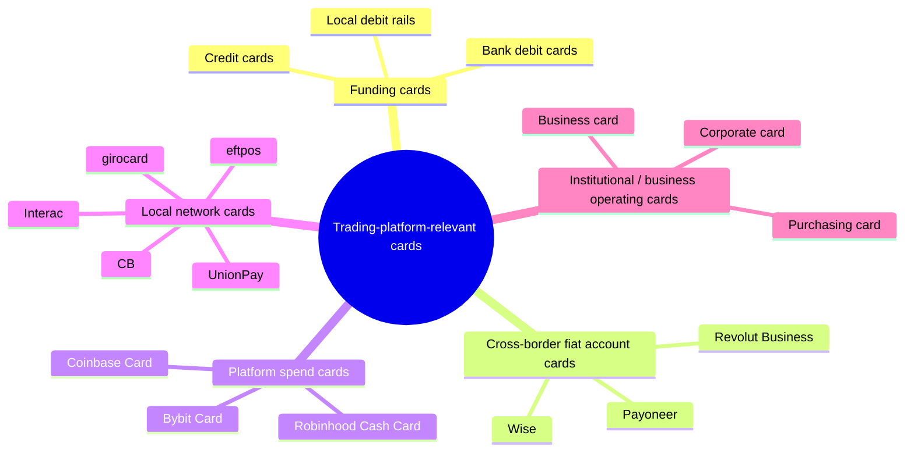

# Card Taxonomy from a Trading-Platform Perspective

> This page is not a consumer-payments encyclopedia. It reclassifies “cards” around what matters to the trading-platform atlas: which cards fund accounts, which cards support cross-border fiat movement, which cards are retention products, and which are mostly background noise. Last checked: 2026-04-23.

---

## One-Line Takeaway

**For trading platforms, the most important card question is not “how nice is it to spend with,” but “can this card move money into the account safely and efficiently, and can that money leave legally afterward?”**

So the useful framework here is:

```text
funding cards
+ cross-border fiat account cards
+ platform spend cards
+ local network cards
+ institutional / business operating cards
```

Not a huge digression into every gift card, campus card, or transit card.

---

## 1. The Five Card Categories That Matter Most



---

## 2. Funding Cards: The Most Important Retail Money-In Rail

### What belongs here

- Bank debit cards
- Some credit cards
- Co-badged local debit-network cards
- International cards that pass 3DS and acquiring checks

### Why they matter

- They are the most natural first-time funding path for retail users.
- They are faster than wire funding.
- They are faster than ACH / SEPA clearing cycles.
- They matter especially for crypto: users can buy and trade immediately.

### Why platforms both love and fear them

| Strength | Cost |
|---|---|
| High conversion | High payment fees |
| Fast availability | High chargeback risk |
| Low user friction | Fraud / stolen-card risk |
| Good for first deposit | Poor efficiency for large tickets |

### Research takeaway

For platforms, card funding is a **conversion-friendly but risk-heavy** rail.

---

## 3. Cross-Border Fiat Account Cards: Wise / Payoneer / Revolut Business

These are not always the primary funding rail, but they matter a lot for cross-border users and the platform-adjacent ecosystem.

### What they solve

- Multi-currency balance management
- Cross-border receiving
- FX conversion
- Overseas ad spend / SaaS / small-scale operations
- Treasury movement for traders, affiliates, and freelancers

### Shared traits

- The card is an extension of the account, not core exchange/broker clearing infrastructure.
- They are better understood as **surrounding fiat tools**, not matching or custody layers.
- Acceptance by trading platforms varies heavily by country and processor setup.

### Internal differences

| Product | Best fit | Position inside this project |
|---|---|---|
| Wise | trader / freelancer / small operator | personal cross-border fiat tool |
| Payoneer | seller / affiliate / business operator | platform-seller and business-spend tool |
| Revolut Business | European and internationally distributed teams | neobank-style business treasury tool |

---

## 4. Platform Spend Cards: Coinbase Card / Bybit Card / Robinhood Cash Card

These are not the same thing as funding cards.

### What they actually do

- Turn platform balances into spendable balances;
- keep user money inside the platform longer;
- increase daily engagement and wallet-like behavior.

### Why platforms issue them

| Business goal | Meaning |
|---|---|
| Improve retention | Users are less likely to withdraw everything |
| Expand use cases | Move from trading into daily spending |
| Add revenue | Interchange / partner economics / membership benefits |
| Centralize account behavior | Become one of the user’s primary money apps |

### Meaning for the atlas

These cards are not trading infrastructure; they are signals of **platform business-model expansion into cash management**.

---

## 5. Local Network Cards: They Shape Real Deposit Success by Country

Many high-level analyses stop at Visa and Mastercard. In reality, domestic networks often determine actual payment success.

### Typical networks

- China: **UnionPay**
- Canada: **Interac**
- Germany: **girocard**
- Australia: **eftpos**
- France: **Cartes Bancaires (CB)**
- Belgium: **Bancontact**
- Denmark: **Dankort**

### Why they matter

- Better domestic acquiring success rates;
- cost structures differ from international schemes;
- in some countries, domestic debit is not really “Visa/Mastercard first”;
- a platform that supports only international schemes may lose local users.

### Atlas implication

A platform’s payments capability should be judged not only by APIs and matching engines, but also by:

```text
which local payment networks it actually supports in each country
```

---

## 6. Institutional / Business Operating Cards: Platforms Spend Too

Trading platforms do not only receive user money; they spend money too.

### Typical use cases

- Ad spend
- Cloud / SaaS
- Travel
- Contractor and vendor payments
- Marketing activity

### Typical card types

- Business cards
- Corporate cards
- Purchasing cards (P-cards)
- Commercial debit / prepaid cards

### Why they belong here

Because many young platforms scale or fail partly based on:

- whether they can pay globally;
- whether they can manage ad spend efficiently;
- whether they can fund global teams and vendors;
- whether they can run multi-currency company finance.

That is as operationally important as the trading stack itself.

---

## 7. Debit, Credit, Prepaid: The Right Weight for This Project

### Debit cards

- The most important retail funding card.
- Closest to the bank-account path.
- More naturally compatible with refund-to-source workflows.

### Credit cards

- Can fund accounts, but create more risk-management pain.
- In crypto they are often associated with cash-advance / quasi-cash treatment.
- Platforms frequently limit countries, BINs, size, and product scope.

### Prepaid cards

- Relevant for some small-ticket situations;
- but usually not the preferred primary funding rail for trading platforms;
- less acceptance and weaker risk fit than standard debit cards.

Conclusion:

```text
inside trading-platform research,
debit > credit > prepaid
```

---

## 8. Low-Relevance Card Types

These cards exist, but should not dominate the atlas:

- gift cards
- campus cards
- transit cards
- meal cards
- gaming cards
- healthcare benefit cards

They are better treated as payments-industry background, not trading-platform core content.

---

## 9. How This Taxonomy Should Be Used in the Atlas

If we continue building platform, architecture, and relationship chapters, cards should feed into:

### 1) Platform funding capability

- Which card networks are supported?
- Debit only or credit too?
- Instant availability or delayed usability?
- Which jurisdictions are restricted?

### 2) Withdrawal and refund logic

- Does the platform refund back to the original card?
- Must profits move out by bank transfer?
- How are AML and fraud rules designed?

### 3) Cross-border fiat tooling

- What role do Wise, Payoneer, and domestic banks play on the user side?
- How are they accepted or limited by platforms?

### 4) Business-model extension

- Does the platform issue its own debit/spend card?
- Is it trying to become a wallet and cash-management app?

---

## 10. Shortest Mnemonic

```text
debit / credit cards = how users fund accounts
Wise / Payoneer = how users move fiat cross-border around platforms
Visa / Mastercard / UnionPay / local networks = which payment road the platform plugs into
Coinbase Card / Bybit Card / Robinhood Cash Card = how platforms turn balances into spend tools
business / corporate cards = how platforms themselves spend money
```

---

## 11. Official Sources

- [Wise Card](https://wise.com/card/)
- [Payoneer Commercial Mastercard](https://www.payoneer.com/solutions/payoneer-commercial-card/)
- [Bybit — Bank Card Terms of Use](https://www.bybit.com/en/help-center/article/?id=000001639)
- [Bybit Card](https://www.bybit.com/en/help-center/article/Bybit-Card-Introduction)
- [Coinbase Card — Use your Coinbase debit card](https://help.coinbase.com/coinbase/trading-and-funding/coinbase-card/use-cb-card)
- [Robinhood — Robinhood Cash Card](https://robinhood.com/us/en/support/articles/robinhood-cash-card/)
- [UnionPay International](https://www.unionpayintl.com/en/)
- [Interac Debit](https://www.interac.ca/en/payments/personal/pay-with-interac-debit/)
- [girocard](https://www.girocard.eu/)
- [eftpos Australia](https://www.eftposaustralia.com.au/)
- [Cartes Bancaires](https://www.cartes-bancaires.com/)
- [Bancontact](https://www.bancontact.com/)
- [Dankort](https://dankort.dk/)
