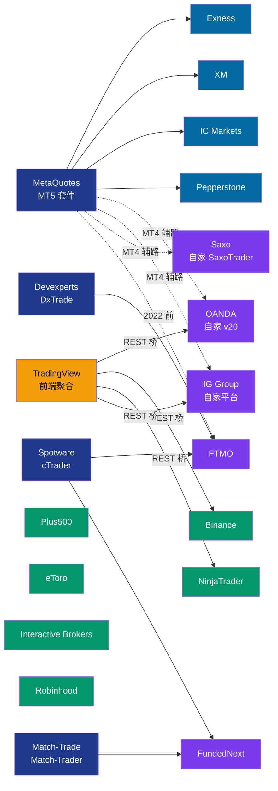

# 白标关系地图

"这家券商的交易平台是自研还是白标？" —— 这个问题的答案定义了它的技术自由度、运营成本、和用户粘性。

---

## 三种基本形态

```
┌─────────────────────────┐   ┌─────────────────────────┐   ┌────────────────────┐
│  A. 纯白标              │   │  B. 混合                │   │  C. 纯自研         │
│                         │   │                         │   │                    │
│  用 MetaQuotes / cTrader│   │  自己写一套 + 同时也     │   │  全栈自己做：撮合   │
│  / Match-Trader 等套件  │   │  给用户选 MT4/5（满足老   │   │  引擎、终端、API、 │
│  改个 logo 卖           │   │  用户习惯）              │   │  风控全自研        │
│                         │   │                         │   │                    │
│  低成本 / 快上线 / 上下│   │  投入大但用户迁移成本低   │   │  投入最大 / 控制 │
│  游依赖 MetaQuotes 政策 │   │                         │   │  最强             │
└─────────────────────────┘   └─────────────────────────┘   └────────────────────┘
```

---

## A. 纯白标 MT5 / MT4（零售外汇主体）

这些 broker 的交易体验 90% 是 MetaQuotes 决定的，他们提供：账户注册、入金、出金、客服、CRM、风控参数配置、流动性接入、合规。**技术栈是 MetaQuotes 的，他们只是运营者**。

| Broker | 监管 | 主要市场 | 流动性策略 |
|---|---|---|---|
| Exness | CySEC / FSCA | 全球 | A-book + B-book 混合 |
| XM | CySEC / ASIC | 全球 | 偏 B-book |
| IC Markets | ASIC | 亚太 / 欧洲 | STP / ECN 声称 |
| Pepperstone | ASIC / FCA | 亚太 / 英 | STP / A-book |
| FxPro | CySEC / FCA | 欧洲 | A-book |
| Admiral Markets | FCA / CySEC | 欧洲 | 混合 |
| Tickmill | CySEC / FCA | 新兴市场 | ECN 声称 |
| FBS | CySEC | 亚洲 | 偏 B-book |
| RoboForex | IFSC | 全球 | 混合 |
| HYCM | FCA / CySEC | 中东 | 混合 |
| OctaFX | CySEC | 亚太 | 偏 B-book |
| AvaTrade | CBI / ASIC | 全球 | 混合 |
| ThinkMarkets | ASIC / FCA | 亚太 | 混合 |
| HotForex (HFM) | CySEC | 非洲 / 亚太 | 混合 |
| Alpari | IFSC | 俄语区 / CIS | 混合 |
| FXTM (ForexTime) | CySEC | 非洲 / 亚太 | 混合 |
| Swissquote | FINMA | 高净值 | A-book |

*还有几百家更小的 broker 跑同样的模式。*

**战略缺陷**：全部命门在 MetaQuotes 手里。如果某天 MetaQuotes 因为监管 / 商业原因撤 license，这些 broker 无法短期内切换（用户、EA 库、运维都不走）。

---

## B. 混合（自研 + MT4/5 并行）

通常是**成立较早的 broker**，自研平台是品牌资产，但零售需求迫使它们同时提供 MT4/5。

| Broker | 自研平台 | 也提供 MT4/5 | 当前主推 |
|---|---|---|---|
| **OANDA** | v20 REST API + fxTrade | MT4 (MT5 有限) | v20 API + TradingView 集成 |
| **IG Group** | IG Web Platform + L2 Dealer | MT4 | IG 自家 + ProRealTime |
| **Saxo Bank** | SaxoTraderGO / PRO + OpenAPI | MT4 较少 | Saxo 自家 + TradingView |
| **CMC Markets** | Next Generation + MT4 | MT4 | CMC 自家 |
| **Dukascopy** | JForex + Dukascopy | MT4 | JForex（Java）为主 |
| **FXCM** | Trading Station + MT4 | MT4 | Trading Station |
| **FOREX.com** | FOREX.com Trader + MetaTrader | MT4/5 | 自家 |
| **Plus500** | Plus500 自家 | 不提供 | Plus500 自家（专有） |
| **eToro** | eToro Web / App | 不提供 | eToro 自家（社交 + 跟单） |
| **Capital.com** | Capital.com + MT4 | MT4 | 自家 |

**Plus500 / eToro 特别**：从不提供 MT4/5，完全自研 + Web 体验。**它们是少数把零售外汇 / CFD 客户从 MT5 中剥离出来的成功案例**——代价是用户不能带 EA 过来。

---

## C. 纯自研 / 完全独立

### 加密交易所（全员此类）
- Binance / OKX / Bybit / Coinbase / Kraken / Bitfinex / Bitstamp / Huobi
- 所有撮合 / API / 钱包 / 客户端都是自家代码
- **理由**：加密赛道没有等同的"MT5 套件"供白标，所以一开始就自研
- **副作用**：每家 API 差异很大，ccxt 等聚合库应运而生

### 期货 / 美国传统
- **Interactive Brokers**：TWS 桌面 + IBKR Mobile + Client Portal Web + REST/FIX API
- **Charles Schwab**：thinkorswim（收购自 TD Ameritrade 2020）
- **E*Trade**：自家平台 + Power E*Trade
- **Robinhood**：Web + iOS / Android，Clojure 后端
- **Fidelity**：Active Trader Pro
- **TastyTrade**：TastyTrade 平台
- **CQG**：CQG Integrated Client（期货 HFT 用）

### 期货专用
- **NinjaTrader**：桌面软件 + NinjaScript（C#）+ 自家 broker
- **TradingView + 接 AMP / NinjaTrader**：TradingView 做前端、期货 broker 做撮合

### Prop Firm（从 MT5 迁移后的新常态 2024+）
- **FTMO**：MT4/MT5 + DxTrade + cTrader（多平台并行，降低 MetaQuotes 单点风险）
- **TopStep**：NinjaTrader 主 + TradingView 桥 + MT5 部分保留
- **FundedNext**：Match-Trader + cTrader
- **Funded Trading Plus**：Match-Trader
- **Earn2Trade**：Match-Trader + NinjaTrader
- **Apex Trader Funding**：Rithmic + NinjaTrader
- **The5ers**：MT4/5 + TradeLocker

---

## TradingView 的独特位置：前端白标 vs 后端白标

传统"白标"= 我买 MetaQuotes 套件改 logo。
TradingView 模式 = **多 broker 聚合的前端**，用户在 TradingView 看图表，下单时后台路由到某家 broker。

下单链路：

```
[TradingView 用户]
  ↓ 登录 TradingView 绑定 broker 账户
[TradingView 前端]
  ↓ REST API 调用
[Broker API 层]（OANDA v20 / Binance / Bybit / AMP / IG 等 40+ broker）
  ↓
[该 broker 的 OMS]
```

**TradingView 自己不撮合、不托管、不拿单**，只做前端 UI + 社区 + 图表。这个角色以前是 MT5 终端，现在 TradingView 抢了一大块。

**支持 TradingView 下单的 broker 2026 年达到 ~40+**（对照 2020 年 ~5 家）。这是 MT5 用户迁徙最安静但数量最大的一条路。

---

## 监管套利视角

**白标 MT5 的券商** 通常在宽松监管地（CySEC / FSCA / IFSC）。原因：监管严的地方（FCA / ASIC）对杠杆 + B-book 规则严，白标模式的差价收益空间被压缩。

**全自研券商** 通常在严监管地（FCA / ASIC / SEC / FINMA）。他们有品牌 + 合规投入，可以在本地定价更高。

---

## Prop Firm 技术栈迁移快照（2024-2026）

| Prop Firm | 2022 | 2024+ | 迁移原因 |
|---|---|---|---|
| FTMO | MT5 | MT4/5 + DxTrade + cTrader | MetaQuotes 施压 + 风险分散 |
| TopStep | MT5 + NinjaTrader | NinjaTrader + TradingView + 少量 MT5 | 期货业务重心 |
| FundedNext | MT4/5 | Match-Trader + cTrader | 平台功能适配度 |
| Funded Trading Plus | MT4/5 | Match-Trader | MetaQuotes 取消 license |
| MyForexFunds | MT4/5 | **被 CFTC 关停 2023** | 不合规 |
| True Forex Funds | MT4/5 | **停业 2024** | MT5 license 被撤 |
| E8 Funding | MT4/5 | Match-Trader | 同上 |
| Earn2Trade | NinjaTrader 主 | Match-Trader + NinjaTrader | 多元化 |

---

## 可视化总图



## 参考

- [Finance Magnates - Broker Directory 年度版](https://www.financemagnates.com/)
- [FXStreet - Best Brokers 评测](https://www.fxstreet.com/brokers)
- [BrokerChooser - 2000+ 券商技术栈对比](https://brokerchooser.com/)
- [TradingView - Supported Brokers](https://www.tradingview.com/brokers/) — 官方列表，近 40 家
- Prop Firm 各自的"Platforms supported" 页面
- MetaQuotes partner list（有时候会公开部分）
