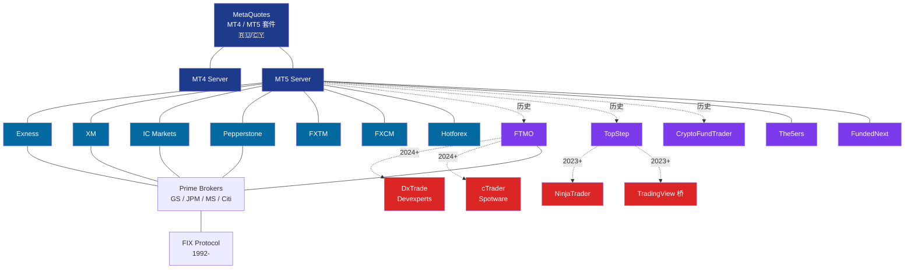
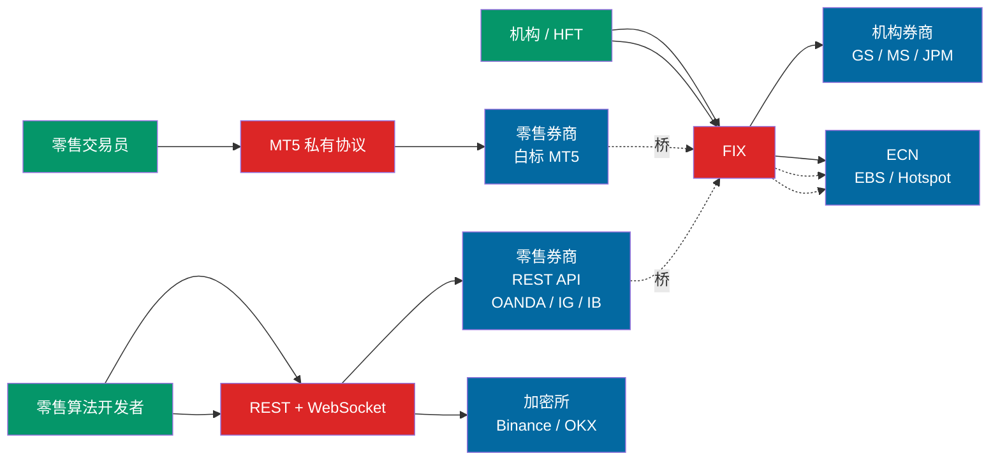
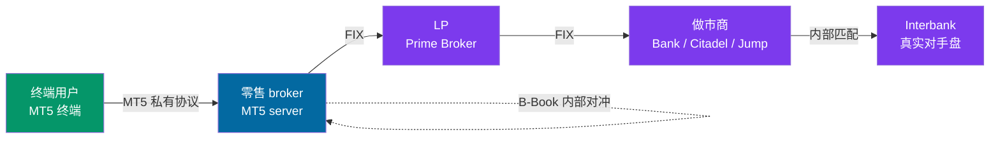
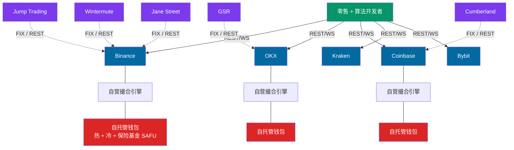
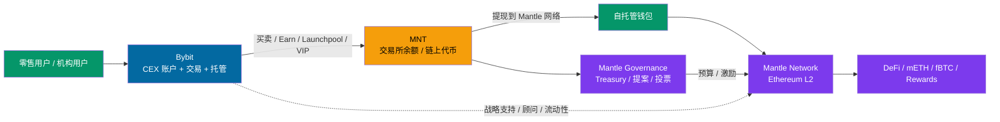
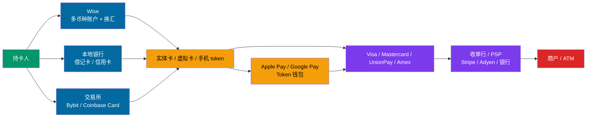
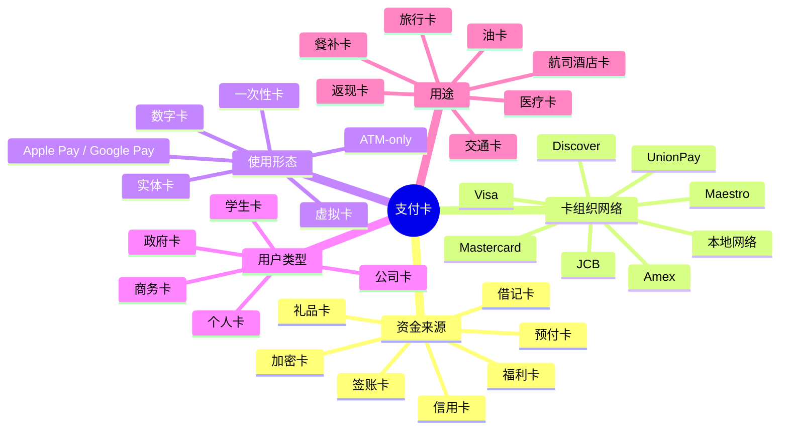
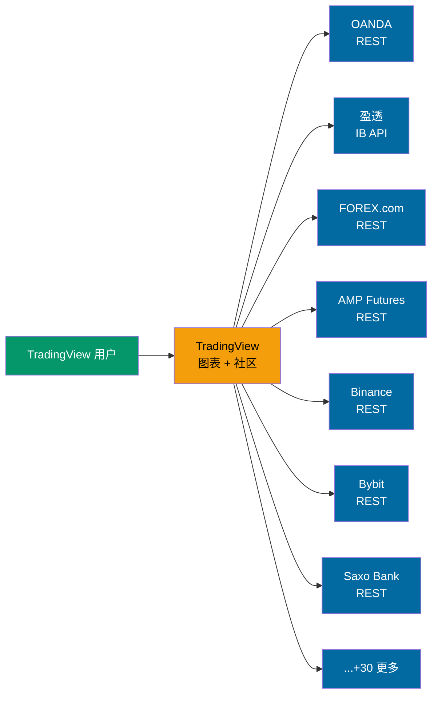
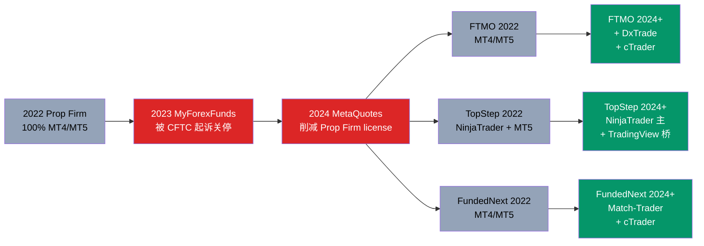

# 交易平台关系图谱（总图）

本图用 Mermaid 画主要玩家之间的"所有权 / 协议 / 数据流"关系。在支持 Mermaid 渲染的工具（VS Code、GitHub、Obsidian、Typora）打开这个文件可直接看图。

## 核心生态：零售外汇 + Prop Firm

## 大图：协议 × 用户群

## 流动性链（零售外汇）

## 加密赛道（完全不同的拓扑）

## Bybit × Mantle：CEX 流量接入 L2

详见：[`07-bybit-mantle.md`](./07-bybit-mantle.md)

## Wise 卡 × 支付卡栈：从 App 到卡组织

详见：[`08-wise-card-payment-card-stack.md`](./08-wise-card-payment-card-stack.md)

## 市面卡分类：资金来源 × 网络 × 形态

详见：[`09-card-taxonomy.md`](./09-card-taxonomy.md)

## TradingView 的"多 broker 聚合"模式

TradingView 是目前唯一能**替代零售交易员在 MT5 终端下单习惯**的平台——它不卖 server 给 broker，而是在浏览器前端连 broker 的 REST API。

## Prop Firm 技术栈迁移 2022 → 2026

## 技术栈所有权一览

| 平台名 | 所属 / 总部 | 成立 | 业务模式 |
|---|---|---|---|
| **MetaQuotes** | Cyprus（原俄罗斯）| 2000 | 卖 MT 套件给 broker |
| **Spotware** | Cyprus | 2011 | cTrader 平台授权 |
| **Trading Technologies (TT)** | Chicago US | 1994 | 期货交易平台 |
| **NinjaTrader** | Denver US | 2003 | 期货交易平台 + Prop Firm 底座 |
| **TradingView** | London UK | 2011 | 图表 + 社交 + broker 聚合 |
| **Devexperts** | US/RU | 2002 | DxTrade 白标平台 |
| **cTrader Copy** | Cyprus（Spotware 子品牌） | 2013 | 跟单 |
| **Match-Trader** | Sofia BG（Match-Trade 母公司） | 2013 | Prop Firm 专用白标平台 |

## 延伸阅读

- `01-ownership.md` — 详细所有权追溯（含 SEC / Companies House 记录）
- `02-liquidity-chain.md` — LP 链条深入
- `03-whitelabel-map.md` — 哪家 broker 用 MT5 / 自研 / 混合
- `../05-trends/` — 这些关系未来怎么变
