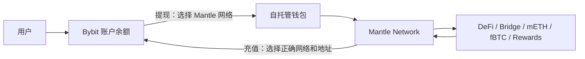

# Bybit × Mantle：交易所、Layer 2 与 MNT 生态

> 本页面向新手：先把 Bybit、Mantle、MNT、BitDAO 分清楚，再解释它们为什么会深度绑定。最后核验日期：2026-04-23。

---

## 一句话结论

**Bybit 是中心化交易所，Mantle 是以太坊 Layer 2 网络，MNT 是 Mantle 生态代币。** 两者不是简单的“母公司 / 子公司”关系；更准确地说，Bybit 是 BitDAO/Mantle 早期最重要的资金、流量和产品分发支持方，Mantle 则是从 BitDAO 体系演化出来的链上生态。

最实用的理解：

- **Bybit**：账号体系 + 撮合交易 + 托管资产 + 衍生品 / 现货 / 理财产品。
- **Mantle Network**：钱包体系 + 链上交易 + 智能合约 + 低费率以太坊 L2。
- **MNT**：在 Mantle 上用于 gas、治理、激励；在 Bybit 上可交易，也被嵌入手续费折扣、VIP、活动和收益产品。
- **BitDAO**：历史上的 DAO / 金库 / 治理壳，后来通过 “One brand, One token” 路线整合进 Mantle 品牌。

---

## 1. 新手心智模型

| 对象 | 它是什么 | 你怎么使用 | 资产控制方式 | 主要风险 |
|---|---|---|---|---|
| Bybit | 中心化交易所 CEX | 邮箱 / 手机 / KYC 登录 App | 平台托管，用户看到账户余额 | 平台风险、账户限制、合约爆仓、地区合规 |
| Mantle Network | 以太坊 Layer 2 区块链 | MetaMask / Rabby / OKX Wallet 等钱包连接 | 自托管，私钥控制链上资产 | 私钥丢失、授权恶意合约、转错链、合约漏洞 |
| MNT | Mantle 原生代币 | 在 Bybit 交易，或提到 Mantle 链上使用 | 可在交易所余额或链上地址中存在 | 价格波动、网络选择错误、代币合约混淆 |
| Mantle Treasury / Governance | 生态金库与治理机制 | MNT 持有人通过提案 / 投票参与 | 金库支出需治理授权 | 治理集中度、执行透明度、预算效率 |

一句话类比：

```text
Bybit = 买卖和托管资产的“交易柜台”
Mantle = 资产进入链上应用的“高速公路”
MNT = 这条高速公路的燃料、治理票和生态积分
```

---

## 2. 关系时间线

| 时间 | 事件 | 关系含义 |
|---|---|---|
| 2021-07 | BitDAO 启动；Bybit 成为核心贡献方之一 | Bybit 给 BitDAO 金库持续贡献资产，形成最早的资本与流量纽带 |
| 2022-06 ~ 2022-11 | BitDAO 社区开始讨论并推出 Mantle 作为模块化 L2 方向 | Mantle 是 BitDAO 资源聚焦后的核心产品化尝试 |
| 2023-02 | BIP-19 通过，为 Mantle testnet 与第一年 mainnet 运营拨预算 | Mantle 从“想法”变成由 DAO 预算支持的核心产品 |
| 2023-03 ~ 2023-04 | BIP-20 将 Bybit 贡献改为 48 个月固定计划 | 目的之一是降低 BIT 被看成“Bybit 交易所币”的风险，增强独立性 |
| 2023-05 ~ 2023-07 | BIP-21 / MIP-22 / MIP-23 推动 “One brand, One token” 与 BIT→MNT | BitDAO 品牌和 BIT 代币逐步整合到 Mantle / MNT |
| 2023-07 | Mantle Network Mainnet Alpha 上线 | Mantle 成为实际可用的 L2 网络 |
| 2025-08 | Mantle 公布引入 Bybit 高管担任顾问 | 两边继续保持战略协作，但表述更偏生态合作与顾问支持 |
| 2025-2026 | Bybit 推出 MNT Program | MNT 从“链上治理 / gas 代币”进一步嵌入 Bybit 手续费、VIP、活动和支付场景 |

---

## 3. Bybit 的具体功能

Bybit 是“交易所层”，核心能力不是上链，而是撮合、托管、风险管理和产品包装。

### 交易功能

- **现货交易**：直接买卖 BTC、ETH、MNT、USDT 等。
- **永续合约 / 期货**：带杠杆做多做空，资金费率机制维持合约价格接近现货。
- **期权**：更复杂的衍生品，适合有定价和波动率基础的用户。
- **统一交易账户 UTA**：把现货、合约、期权和保证金管理整合到同一账户体系。

### 用户增长和资产产品

- **Earn / 理财**：把资产包装成活期、定期、质押、结构化收益等产品。
- **Launchpad / Launchpool / Megadrop**：用平台流量给新项目分发代币。
- **Copy Trading / Trading Bots**：把交易策略产品化，让新手复制或自动化执行。
- **Bybit Card / Pay**：把交易所资产延伸到消费和支付场景。

### MNT 在 Bybit 上的用途

根据 Bybit MNT Program，MNT 可用于：

- 在 Bybit 通过充值、现货、Convert、DCA、OTC 等方式获得。
- 支付部分现货 / 现货杠杆 / USDT 与 USDC 合约交易手续费，并获得折扣。
- 提升 VIP 资产计算权重，即 MNT 资产乘数。
- 参与 Launchpool、Launchpad、Megadrop、Token Splash 等持币权益。
- 在 Card / Pay 场景里作为 cashback 或支付资产之一。

注意：**放在 Bybit 账户里的 MNT 是交易所记账余额，不等于你已经在 Mantle 链上操作。** 只有把 MNT 提到自托管钱包，并选择正确网络后，才进入链上使用场景。

---

## 4. Mantle 的具体功能

Mantle 是“链上执行层”，核心目标是让以太坊生态的交易更便宜、更快，并让项目方能在熟悉的 EVM 环境中部署应用。

### 网络层

- **Ethereum Layer 2**：Mantle 依赖以太坊生态和 EVM 兼容性，但把交易执行移到 L2 上。
- **模块化架构**：执行、数据可用性、最终性等模块可升级，官方叙事强调模块化和低费用。
- **数据可用性 / EigenDA**：Mantle 官方长期把 EigenLayer / EigenDA 集成作为差异化技术路线之一。
- **桥接**：用户可通过官方桥或第三方桥把资产从 Ethereum L1 / 其他链转入 Mantle。

### 应用层

Mantle 不只是“一条链”，还在做围绕原生资产和收益资产的生态：

- **DeFi**：DEX、借贷、流动性挖矿、收益聚合器。
- **mETH Protocol**：Mantle 体系内的 ETH 流动性质押 / 再质押资产。
- **Ignition fBTC**：把 BTC 带入 Web3 / DeFi 的 wrapped BTC 资产方向。
- **稳定币与 RWA 收益合作**：官方页面提到 Ethena USDe、Agora AUSD、Ondo USDY 等合作方向。
- **EcoFund**：Mantle EcoFund 用生态基金投资和激励项目。

### MNT 在 Mantle 上的用途

根据 Mantle tokenomics 文档：

- **治理**：每个 MNT 提供 Mantle Governance 投票权重。
- **gas**：MNT 是 Mantle Network 的 gas fee 资产。
- **生态激励**：MNT 是 Mantle Rewards Station 和生态激励中的主要资产之一。
- **金库资源管理**：Mantle Treasury 中的 MNT 需要通过治理预算提案授权分发。

常用地址：

- **Ethereum L1 MNT**：`0x3c3a81e81dc49A522A592e7622A7E711c06bf354`
- **Mantle L2 MNT**：`0xdeaddeaddeaddeaddeaddeaddeaddeaddead0000`
- **Mantle L2 wMNT**：`0x78c1b0C915c4FAA5FffA6CAbf0219DA63d7f4cb8`

---

## 5. 资产流动：从 Bybit 到 Mantle

新手最容易混淆的是：**同一个代币符号 MNT，可以存在于不同账本里。**



关键检查项：

1. **地址**：复制钱包地址，不要手打。
2. **网络**：提现 MNT 时确认是 Mantle 网络、Ethereum 网络，还是其他支持网络。
3. **小额测试**：第一次只转很小金额。
4. **gas**：在 Mantle 上操作需要 MNT 作为 gas。
5. **授权**：连接 dApp 时看清楚授权对象和额度，避免无限授权给陌生合约。
6. **地区限制**：Bybit 服务范围会因司法辖区变化，尤其美国、中国大陆、香港、新加坡、加拿大等地区限制需查官方最新列表。

---

## 6. 为什么 Bybit 要支持 Mantle

从交易所角度，Mantle 给 Bybit 带来三类战略价值：

### 1. 交易所币叙事升级

早期 BIT 很容易被外部理解为“Bybit 平台币”。BIP-20 明确提到，要降低 BIT 被视为中心化交易所代币或 Bybit Token 的风险。BIT→MNT 后，叙事从“交易所币”转向“L2 生态代币”。

### 2. CEX 流量导入链上

Bybit 有用户、法币入口、现货 / 合约流动性和活动分发能力；Mantle 有链上应用和生态预算。两者组合后，Bybit 可以把交易所用户导入 Mantle 的 DeFi、收益资产、Launchpool 和链上活动。

### 3. 资产与收益场景闭环

Mantle 生态做 mETH、fBTC、稳定币收益、EcoFund 等资产方向；Bybit 则可以把这些资产接入交易、抵押、理财、支付、机构服务等 CEX 场景。官方首页也把 Bybit 支持描述为增强 Mantle 流动性、DeFi-CeFi 互操作和法币出入金。

---

## 7. 为什么 Mantle 需要 Bybit

从 L2 角度，最大的难题不是“能不能发链”，而是：

- 有没有开发者和应用愿意部署？
- 有没有用户愿意跨链进来？
- 有没有稳定币、ETH、BTC、做市和收益资产？
- 有没有足够活动和补贴让冷启动完成？
- 有没有交易所支持充提、做市和价格发现？

Bybit 能提供的是：

- **上币与流动性**：MNT 现货 / 衍生品交易、充值提现、做市深度。
- **用户分发**：App 首页、活动、Launchpool、Megadrop、Earn。
- **法币入口**：通过交易所完成入金，再把资产提到 Mantle。
- **机构接口**：做市商、VIP、API 用户、托管和抵押场景。
- **品牌背书**：交易所流量让 Mantle 比多数新 L2 更容易被散户看见。

---

## 8. 和 Binance × BNB Chain 的区别

新手常把 Mantle 理解成 “Bybit 的 BNB Chain”。这个类比有帮助，但不完全准确。

| 维度 | Binance × BNB Chain | Bybit × Mantle |
|---|---|---|
| 起点 | 交易所平台币 BNB 与 Binance 生态 | BitDAO 金库 / 治理演化为 Mantle / MNT |
| 链定位 | BNB Smart Chain 是独立 L1 / EVM 链 | Mantle 是 Ethereum L2 / 模块化链 |
| 关系表述 | Binance 与 BNB Chain 生态历史绑定极强 | Bybit 是 Mantle 的重要支持方、合作方和顾问资源 |
| 代币功能 | BNB 用于交易所折扣、gas、生态 | MNT 用于 Mantle gas / 治理，也被 Bybit 接入折扣和 VIP |
| 去中心化叙事 | 从交易所生态向社区生态迁移 | 从 BitDAO 社区与金库治理向 Mantle 产品品牌聚焦 |

更精准的判断：**Bybit × Mantle 是 CEX 流量与 DAO/L2 生态的深度耦合，不是传统公司控股关系。**

---

## 9. 新手操作路径

### 只想学习 / 观察

1. 先理解 CEX、钱包、L1、L2、gas、桥、授权。
2. 在 Bybit 或 CoinGecko 看 MNT 价格和交易量。
3. 去 Mantle 官网看生态项目，不急着连接钱包。
4. 用区块浏览器查一笔 MNT 转账，理解链上记录。

### 想买 MNT

1. 确认所在地区允许使用 Bybit 或其他合规交易所。
2. 用现货买入，不用杠杆。
3. 明确目的：只是持有 / 交易，还是要去 Mantle 链上用。
4. 如果只是持有，理解交易所托管风险。

### 想体验 Mantle 链

1. 准备自托管钱包，备份助记词，绝不截图 / 上传。
2. 从交易所小额提现 MNT 到 Mantle 网络。
3. 第一次只做简单转账或官方桥操作。
4. 逐步接触 DEX、mETH、fBTC、Rewards 等应用。
5. 不懂合约授权时不要点击“无限授权”。

### 不建议新手一开始做

- 高倍永续合约。
- 借贷套娃、循环质押、跨链套利。
- 不知名空投链接。
- 用 VPN 绕过交易所地区限制。
- 把全部资金一次性跨链或提现。

---

## 10. 核心风险清单

| 风险 | 出现场景 | 控制方式 |
|---|---|---|
| 价格波动 | 买入 MNT 或参与 MNT 活动 | 不用借钱 / 杠杆，控制仓位 |
| 平台风险 | MNT 放在 Bybit 账户 | 只放交易所需资金，了解托管风险 |
| 地区合规 | 使用 Bybit 产品 | 先看 Bybit 官方 restricted countries |
| 链选择错误 | 提现 / 充值 MNT | 逐项核对网络和地址，小额测试 |
| 私钥丢失 | 自托管钱包 | 离线备份助记词，不发给任何人 |
| 合约风险 | DeFi、桥、收益产品 | 用官方链接，小额试用，看审计和 TVL |
| 授权风险 | 连接陌生 dApp | 限额授权，定期 revoke |
| 桥风险 | 跨链资产 | 优先官方桥 / 大型桥，避免非必要跨链 |
| 治理风险 | 金库预算、激励分配 | 跟踪 Mantle Forum、Snapshot、Treasury Monitor |

---

## 11. 需要长期跟踪的问题

- **Bybit 对 MNT 权益的持续强度**：手续费折扣、VIP 乘数、Launchpool 权益会不会变化。
- **Mantle 技术路线升级**：ZK roadmap、数据可用性、最终性和安全模型如何落地。
- **Mantle Treasury 使用效率**：EcoFund、预算提案、激励是否带来真实用户和开发者。
- **MNT 代币分布**：交易所、金库、团队 / 预算钱包、生态激励的变化。
- **CeFi-DeFi 资产闭环**：mETH、fBTC、稳定币收益资产能否在 Bybit 与 Mantle 间形成真实使用。
- **监管风险**：交易所地区限制、MNT 作为代币的可交易性、美国相关限制。

---

## 12. 官方来源

- [Mantle 官网](https://www.mantle.xyz/)
- [Mantle Network 页面](https://www.mantle.xyz/network)
- [Mantle Tokenomics](https://docs.mantle.xyz/governance/parameters/tokenomics)
- [BIP-19: Securing the Future with Mantle](https://forum.mantle.xyz/t/passed-bip-19-securing-the-future-with-mantle-a-comprehensive-plan/4533)
- [BIP-20: Adjustments to Bybit Contributions](https://discourse.bitdao.io/t/passed-bip-20-adjustments-to-bybit-contributions-to-the-bitdao-treasury-to-improve-tokenomics-project-focus-and-decentralization/4876)
- [BIP-21: Optimization of Brand, Token, and Tokenomics](https://forum.mantle.xyz/t/passed-bip-21-optimization-of-brand-token-and-tokenomics/5327)
- [Mantle Mainnet Alpha](https://www.mantle.xyz/blog/announcements/mantle-network-mainnet-alpha)
- [Bybit: Introduction to the MNT Program](https://www.bybit.com/en/help-center/article/Introduction-to-the-MNT-Program?category=bcaeae54c20e409dbc)
- [Bybit: FAQ — Paying Trading Fees with MNT](https://www.bybitglobal.com/en/help-center/article/FAQ-Paying-Trading-Fees-with-MNT/)
- [Bybit: Service Restricted Countries](https://www.bybit.com/en/help-center/article/Service-Restricted-Countries/trade/trade/spot/)
- [Mantle: Bybit advisory board announcement](https://group.mantle.xyz/blog/announcements/mantle-welcomes-bybit-luminaries-to-advisory-board)
