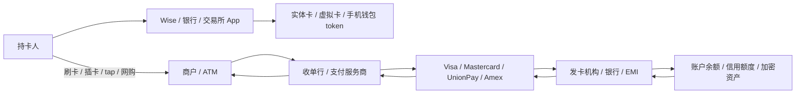
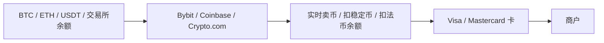

# Wise 卡 × 各类银行卡 / 虚拟卡 / 加密卡：支付卡栈关系图

> 本页面面向新手：先把 Wise 卡放到整个“卡支付网络”里，再解释它和借记卡、信用卡、预付卡、旅行卡、虚拟卡、Apple Pay / Google Pay、Bybit / Coinbase 等加密卡的区别。最后核验日期：2026-04-23。

---

## 一句话结论

**Wise 卡不是信用卡，也不是 Visa / Mastercard 本身。它是 Wise 多币种账户上的一张国际借记 / 预付式支付卡，底层走 Visa 或 Mastercard 等卡组织网络。**

最重要的心智模型：

- **Wise**：账户、余额、换汇、App、风控和用户关系。
- **Wise 卡**：把 Wise 账户余额接入线下 POS、线上商户和 ATM 的卡产品。
- **Visa / Mastercard**：卡组织 / 支付网络，不直接等于发卡方。
- **发卡机构 / 银行合作方**：按地区不同，负责发卡、BIN、合规和清算。
- **Apple Pay / Google Pay**：不是新卡，而是把已有卡 token 化后放进手机钱包。

一句话类比：

```text
Wise 账户 = 钱包和换汇账户
Wise 卡 = 这只钱包伸到商户和 ATM 的“卡接口”
Visa / Mastercard = 卡交易高速公路
银行 / 发卡机构 = 发卡牌照和清算身份
```

---

## 1. 支付卡栈：一笔刷卡交易里谁在干什么



关键点：

- **卡产品**不等于**卡组织**：Wise Card、Revolut Card、Bybit Card 是产品；Visa / Mastercard / UnionPay 是网络。
- **发卡方**不一定是你看到的品牌：很多 fintech 卡背后有持牌银行、电子货币机构或 BIN sponsor。
- **商户接入的是收单侧**：商户通常和 Stripe、Adyen、银行收单、支付宝 / 微信支付服务商合作，而不是直接对接 Wise。
- **卡网络负责路由和规则**：Visa / Mastercard 等负责授权、清算、争议规则和全球受理网络。
- **余额来源决定卡类型**：如果扣 Wise 余额，接近借记 / 预付；如果动用银行信用额度，就是信用卡；如果从加密资产卖币支付，就是加密卡。

### Visa / Mastercard / UnionPay / Amex 的位置

- **Visa / Mastercard**：典型“四方模式”网络，连接持卡人、发卡方、商户、收单方；它们通常不直接给普通用户放贷。
- **UnionPay**：中国本地最重要的卡组织和国际受理网络，国内覆盖强；海外受理取决于当地商户、ATM、收单和发卡行开通情况。
- **American Express**：既是网络，也经常同时扮演发卡和商户关系方；官方材料强调其 closed-loop network 数据和商户网络能力。
- **Wise / Revolut / Bybit / Coinbase**：这些是卡产品品牌或账户平台，不是卡组织本身。

---

## 2. Wise 卡到底是什么

Wise Card 是 Wise 多币种账户的消费接口。它的核心价值不是“奖励积分”，而是**跨境支付和换汇透明度**。

### Wise 卡能做什么

- **线下刷卡 / contactless**：在支持对应卡组织网络的商户使用。
- **线上付款**：用卡号、有效期、CVV 支付。
- **ATM 取现**：可取当地现金，但有免费额度、次数和超额费用规则。
- **多币种消费**：如果账户里有对应币种余额，优先扣该币种；没有则按 Wise 规则自动换汇。
- **实体卡 + 数字卡**：不同地区支持实体卡、数字卡或虚拟卡。
- **手机钱包**：在支持地区可加入 Apple Pay / Google Pay 等。

### Wise 卡不是这些东西

- **不是信用卡**：通常没有授信额度，不适合建立信用记录，也没有传统信用卡的分期 / 循环利息逻辑。
- **不是银行账户本身**：卡只是访问 Wise 余额的入口；账户能力取决于所在地区和 Wise 当地牌照安排。
- **不是 UnionPay 卡**：在中国大陆等场景，Wise 卡通常只能在支持 Visa / Mastercard 的商户或 ATM 使用，不等同于银联本地卡。
- **不是万能旅行卡**：部分商户、国家、ATM 类型、押金场景、离线交易或高风险商户可能无法使用。
- **不是加密卡**：Wise 不会把 BTC / ETH / USDT 直接作为支付余额来源。

---

## 3. Wise 卡和各种卡的区别

更完整的卡片分类框架见 [`09-card-taxonomy.md`](./09-card-taxonomy.md)；本节只保留和 Wise 最相关的对照。

| 类型 | 资金来源 | 典型代表 | 适合场景 | Wise 卡关系 |
|---|---|---|---|---|
| 银行借记卡 | 银行活期账户余额 | 招行 / Chase / HSBC debit | 本地消费、工资账户、ATM | Wise 卡类似借记体验，但账户是 Wise 多币种余额 |
| 信用卡 | 银行授信额度 | Visa / Mastercard / Amex 信用卡 | 延迟还款、积分、保险、酒店押金 | Wise 卡不是信用卡，通常没有授信和积分核心玩法 |
| 预付卡 | 先充值后消费 | 旅行预付卡、礼品卡 | 控制预算、临时消费 | Wise 卡有预付属性，但比传统预付卡多了多币种账户和换汇功能 |
| 多币种旅行卡 | 多币种余额 + 卡消费 | Wise、Revolut、YouTrip | 出国旅行、跨境消费 | Wise 属于这一类的代表之一 |
| 虚拟卡 | 数字卡号，无实体塑料卡 | Wise digital card、Revolut virtual card | 网购、订阅、分账风控 | Wise 可提供数字 / 虚拟卡，底层仍走卡网络 |
| 手机钱包卡 | 卡 token 化到手机 | Apple Pay、Google Pay | 线下 tap、线上一键支付 | Wise 卡可作为被加入的钱包卡，Apple Pay 本身不是发卡方 |
| 加密卡 | 交易所余额或加密资产变现 | Bybit Card、Coinbase Card、Crypto.com Card | 用加密资产消费、返现 | 和 Wise 卡同走卡网络，但资金来源和监管风险不同 |
| 商务 / 公司卡 | 公司账户或费用管理额度 | Brex、Ramp、Wise Business Card | 团队报销、SaaS 订阅 | Wise Business Card 偏跨境付款和多币种开支 |
| 本地支付卡 | 本地网络和银行账户 | UnionPay、Interac、EFTPOS | 本地高覆盖消费 | Wise 卡跨境强，本地网络覆盖未必强 |

---

## 4. Wise 卡 vs 银行借记卡

### 银行借记卡的强项

- 本地 ATM 和本地收单网络覆盖强。
- 常和工资、房租、水电、贷款、信用记录绑定。
- 在本国监管和消费者保护框架内更成熟。
- 在部分国家支持本地专有网络，如银联、Interac、EFTPOS、Girocard。

### Wise 卡的强项

- 多币种余额和跨境换汇体验更清楚。
- 出国消费时可以减少传统银行不透明加价。
- 可提前持有 USD、EUR、GBP、JPY 等多币种余额。
- 更适合自由职业、跨境收款、小额国际旅行和海外网购。

### 关键区别

```text
银行借记卡 = 本地银行账户的消费入口
Wise 卡 = Wise 多币种余额的全球消费入口
```

如果你长期生活在一个国家，银行借记卡是基础设施；如果你经常跨境收付、旅行或网购，Wise 卡是补充工具。

---

## 5. Wise 卡 vs 信用卡

信用卡和 Wise 卡的底层逻辑完全不同。

| 维度 | Wise 卡 | 信用卡 |
|---|---|---|
| 钱从哪里来 | Wise 账户已有余额 | 银行授信额度 |
| 是否借钱 | 通常不是 | 是，先消费后还款 |
| 是否有利息 | 没有信用卡循环利息 | 逾期或循环还款有高利息 |
| 积分 / 里程 | 不是核心卖点 | 常是核心卖点 |
| 酒店 / 租车押金 | 可能受限 | 通常更适合 |
| 建立信用记录 | 通常不能 | 可以 |
| 跨境换汇透明度 | 强 | 取决于银行和卡组织费率 |

新手判断：

- **想控制预算 / 出国消费 / 跨境网购**：Wise 卡更直观。
- **想拿积分、航司里程、酒店押金、消费保护**：信用卡更强。
- **担心超支或利息**：Wise 卡比信用卡更不容易滚债。

---

## 6. Wise 卡 vs Revolut / YouTrip / Monzo / N26 等多币种卡

这些产品属于同一个大类：**fintech 多币种账户 + 卡消费**。

共同点：

- App 开户、卡消费、汇率显示、跨境付款。
- 多数提供实体卡、虚拟卡和 Apple Pay / Google Pay。
- 底层也依赖 Visa / Mastercard 等卡组织。
- 牌照和保护机制因地区不同而变化。

Wise 的相对特点：

- 更偏**跨境汇款和真实换汇成本透明**。
- 汇款线路和本地收款账户能力较强。
- 不主打 crypto、股票、社交金融或高频交易。
- 适合“我需要多币种收付和消费”，而不是“我想要一个超级金融 App”。

Revolut / Monzo / N26 等通常更像新银行或综合金融 App，可能把预算管理、股票、crypto、保险、订阅权益、青少年账户等放在同一产品里。

---

## 7. Wise 卡 vs Payoneer Card

Wise 和 Payoneer 都服务跨境收付，但卡产品定位不同：

| 维度 | Wise Card | Payoneer Card |
|---|---|---|
| 主要用户 | 个人、自由职业、旅行、跨境生活 | 跨境卖家、广告投放、平台收款、B2B 支付 |
| 资金来源 | Wise 多币种余额 | Payoneer USD / EUR / GBP / CAD 等余额 |
| 卡网络 | Visa / Mastercard，按地区不同 | Mastercard 为主，商业卡定位明显 |
| 典型用途 | 旅行消费、海外网购、小额日常支出 | 广告费、SaaS、库存、供应商和公司开支 |
| 费用结构 | 强调透明换汇和 ATM 规则 | 商业卡费用、年费、跨境和换汇费用需看账户 |

简单判断：

```text
Wise 更像“个人和小团队的跨境法币账户 + 卡”。
Payoneer 更像“跨境卖家 / 平台收款人的商业付款账户 + 卡”。
```

如果你的收入来自 Amazon、TikTok、Upwork、广告投放或 B2B 平台，Payoneer Card 的商业开支定位更强；如果你主要是旅行、留学、海外网购、自由职业收款和换汇，Wise 通常更直观。

---

## 8. Wise 卡 vs 加密交易所卡

Bybit Card、Coinbase Card、Crypto.com Visa Card 等属于另一类：**交易所 / 加密资产余额接入传统卡网络**。



| 维度 | Wise 卡 | 加密交易所卡 |
|---|---|---|
| 资金来源 | 法币多币种余额 | 加密资产、稳定币或交易所法币余额 |
| 主要价值 | 换汇、跨境支付、透明费用 | 用加密资产消费、返现、交易所权益 |
| 风险 | 地区可用性、账户审查、换汇费 | 交易所风险、币价波动、税务记录、监管变化 |
| 税务复杂度 | 相对低 | 可能每笔消费都涉及资产处置记录 |
| 新手友好度 | 较高 | 取决于是否理解加密资产和税务 |

关键区别：**Wise 卡把法币变得更跨境；加密卡把加密资产包装成法币消费。**

---

## 9. 实体卡、虚拟卡、数字卡、手机钱包的关系

这些不是互斥类型，而是同一张卡能力的不同外壳：

| 名称 | 本质 | 典型用途 |
|---|---|---|
| 实体卡 | 塑料卡，有芯片 / 磁条 / NFC | 线下刷卡、ATM |
| 数字卡 | App 里显示的卡信息 | 立刻线上消费 |
| 虚拟卡 | 可独立生成 / 替换的卡号 | 订阅、临时网购、风控 |
| 一次性虚拟卡 | 每次交易换卡号 | 高风险商户试用 |
| Apple Pay / Google Pay | 卡 token 放进手机钱包 | 线下 tap、App 内支付 |

Wise 的数字 / 虚拟卡和实体卡背后仍然是同一个账户体系。Apple Pay / Google Pay 只是把卡号替换成设备 token，提升便利性和安全性；它们本身不决定汇率、手续费或发卡资格。

---

## 10. Wise 卡在中国 / 亚洲使用时的常见误区

> 具体可用性以 Wise 和当地监管为准；本节是机制解释，不是开户建议。

- **有 Wise 卡 ≠ 有中国本地银行卡**：它不接入银联借记卡体系，不能替代国内银行卡。
- **Visa / Mastercard 标志不等于处处可刷**：中国大陆很多小商户更依赖支付宝、微信支付、银联和本地收单。
- **ATM 可用性不稳定**：取决于 ATM 支持的国际卡网络和发卡地区限制。
- **商户押金场景可能卡住**：酒店、租车、加油站预授权对借记 / 预付类卡不一定友好。
- **Wise 服务地区会变化**：Wise 卡申请资格、寄送地区、币种余额、费用和钱包支持都按国家 / 地区不同。

---

## 11. 新手怎么选

### 如果你主要在本国生活

- 本地银行借记卡 + 一张合适信用卡是基础。
- Wise 卡作为跨境网购、旅行和收款补充。

### 如果你经常出国 / 海外网购

- Wise 卡适合提前换汇、持有多币种余额和小额日常消费。
- 信用卡适合酒店 / 租车押金、积分、保险和大额消费保护。

### 如果你收外币收入

- Wise 更适合收款、换汇、转账和日常花费闭环。
- 本地银行账户仍适合缴税、工资、贷款、长期储蓄。

### 如果你持有加密资产

- 加密卡适合把交易所资产接入日常消费。
- 但每笔消费可能涉及卖币、税务记录、交易所风控和监管风险。
- Wise 卡不适合直接花加密资产。

---

## 12. 风险清单

| 风险 | 出现场景 | 控制方式 |
|---|---|---|
| 地区不可用 | 申请 Wise 卡或交易所卡 | 先查官方 supported countries |
| 费用误解 | 跨币种消费、ATM 取现 | 看 Wise 费用页和 ATM 免费额度 |
| 商户拒付 | 押金、离线交易、高风险商户 | 准备备用信用卡 / 本地卡 |
| 汇率波动 | 提前换汇或自动换汇 | 小额分批，不把投资判断混入支付工具 |
| 账户审查 | 大额跨境收付 | 保留资金来源证明和发票 |
| 卡盗刷 | 网购、订阅、实体卡丢失 | 用虚拟卡、限额、即时冻结 |
| 税务记录 | 加密卡消费 | 记录每笔资产处置和成本价 |
| 卡网络受限 | 特定国家 / ATM / 商户 | 准备第二网络卡，如 Visa + Mastercard / 本地卡 |

---

## 13. 关系总结

```text
Wise 卡不是“另一种 Visa”，而是 Wise 把多币种账户接入 Visa / Mastercard 网络的产品。

银行借记卡解决本地生活。
信用卡解决信用、积分和押金。
Wise 卡解决跨境法币支付和换汇。
Revolut / N26 / Monzo 解决新银行 App 体验。
Bybit / Coinbase / Crypto.com 卡解决加密资产消费入口。
Apple Pay / Google Pay 解决手机上的 token 化支付。
Visa / Mastercard / UnionPay / Amex 解决全球或本地卡网络路由。
```

---

## 14. 官方来源

- [Wise Card](https://wise.com/card/)
- [Wise Help: What are the Wise card fees?](https://wise.com/help/articles/2935769/what-are-the-wise-card-fees)
- [Wise Help: Getting a Wise card](https://wise.com/help/articles/2968915/can-i-get-the-wise-card-in-my-country)
- [Wise Help: Spending abroad with your card](https://wise.com/help/articles/2935771/how-do-i-use-my-wise-card-abroad)
- [Wise: Virtual Card](https://wise.com/us/virtual-card/)
- [Wise Help: Apple Pay / Google Pay](https://wise.com/help/articles/2978018/can-i-use-my-wise-card-with-apple-pay-or-google-pay)
- [Visa: Accept Visa payments](https://usa.visa.com/run-your-business/accept-visa-payments.html)
- [Mastercard: How payments work](https://www.mastercard.us/en-us/business/overview/payment-processing.html)
- [UnionPay International](https://www.unionpayintl.com/en/)
- [American Express Global Network](https://network.americanexpress.com/globalnetwork/v4/partners/acquirers/power-of-the-network/)
- [CFPB: Prepaid cards](https://www.consumerfinance.gov/consumer-tools/prepaid-cards/)
- [Payoneer Commercial Mastercard](https://www.payoneer.com/solutions/payoneer-commercial-card/)
- [Bybit Card](https://www.bybit.com/en/help-center/article/Bybit-Card-Introduction)
- [Coinbase Card](https://help.coinbase.com/en/coinbase/trading-and-funding/coinbase-card/coinbase-card-for-the-us)
- [Crypto.com Visa Card](https://www.crypto.com/cards/)
