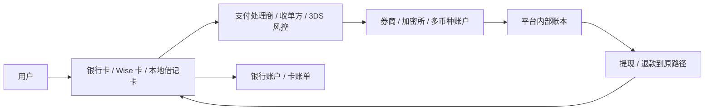

# Wise 卡 × 交易平台资金通道：银行卡、卡组织与交易账户的关系

> 本页面只保留和本项目相关的部分：卡如何服务券商、加密所、跨境收款账户和交易平台的入金、出金、换汇、消费卡留存。最后核验日期：2026-04-23。

---

## 一句话结论

**从交易平台视角看，卡不是“消费工具”那么简单，而是一条高转化、高手续费、高欺诈风险的入金和出金通道。**

更准确地说：

- **Wise 卡**：更像跨境法币账户的支付接口，适合跨币种收付、消费和小额跨境资金调度。
- **银行借记卡 / 信用卡**：是交易平台最常见的法币入金入口之一，但风控、退款和可用性差异极大。
- **Visa / Mastercard / UnionPay 等**：是卡交易路由和规则层，不是交易平台本身。
- **交易所卡 / 券商卡**：不是入金通道，而是平台把余额重新包装成可消费的 retention 产品。

这个项目真正关心的不是“哪张卡返现高”，而是：

```text
用户怎么把法币打进交易账户
平台怎么控制 chargeback 和欺诈
为什么卡入金快但贵
为什么很多平台提现优先退回原卡
为什么 Wise / Payoneer / 本地借记卡对交易平台的意义不同
```

---

## 1. 为什么交易平台都关心“卡”

对交易平台来说，卡有四个核心作用：

### 1）获客入口

- 新用户第一次入金，最容易用的是 **debit / credit card**。
- 卡支付门槛低，不需要等电汇或 ACH 清算。
- 对加密所尤其重要：用户可以“先买币，再开始交易”。

### 2）即时可用资金

- Coinbase 官方长期把 **debit card purchase** 当成“更快拿到可用资金”的路径。
- Bybit 也把 bank card purchase 放进 One-Click Buy。
- 这对想立刻开仓的用户很重要。

### 3）退款和原路退回

- eToro 明确写：如果你用借记卡入金，提现通常会先按 **refund to original payment method** 处理。
- 这不是用户体验设计，而是支付合规和反洗钱控制。

### 4）平台留存和钱包化

- Robinhood Cash Card、Coinbase Card、Bybit Card 这类产品，不是为了“更方便入金”，而是为了把平台余额延伸到日常消费场景。
- 本质是把交易账户做成更高粘性的现金管理 / 消费账户。

---

## 2. 交易平台里的卡支付链路



这条链里，平台最关心的不是“支付成功”本身，而是：

- 这笔钱是不是**真可逆**？
- 后面会不会 **chargeback**？
- 卡组织和收单方会不会把它视为 **高风险 / quasi-cash**？
- 这笔钱什么时候才算能安全放行给用户提现吗？

---

## 3. 卡在交易平台里主要分三种角色

| 角色 | 典型产品 | 在交易平台里的意义 |
|---|---|---|
| 入金卡 | 银行借记卡、信用卡、本地 debit | 把法币充值到交易账户 |
| 跨境账户卡 | Wise、Payoneer、Revolut Business | 跨币种收付、平台运营、跨境出入金辅助 |
| 平台消费卡 | Coinbase Card、Bybit Card、Robinhood Cash Card | 把平台余额变成可消费资产，提高留存 |

这三类卡不能混为一谈。

---

## 4. Wise 卡在这个体系里的位置

Wise 对交易平台研究有价值，不是因为它是“好用的旅行卡”，而是因为它处在 **银行账户、跨境收款工具、支付卡** 三者之间。

### Wise 的平台相关价值

- **多币种余额**：适合处理 USD、EUR、GBP 等不同币种的法币调度。
- **换汇透明**：对跨境交易员、内容创作者、自由职业者、海外团队更友好。
- **卡+账户一体**：既能收款、换汇，也能线下 / 线上支付。
- **小额跨境周转**：比传统银行国际汇款更轻量。

### Wise 不是交易平台的什么

- 不是券商 / 交易所主清算账户。
- 不是卡组织。
- 不是用户证券或加密资产托管方。
- 不是高额度机构资金调拨的最终方案。

一句话：

```text
Wise 更像交易平台外围的跨境法币工具，
不是交易撮合、清算、托管的核心基础设施。
```

---

## 5. Wise 卡 vs 银行借记卡：在交易入金上的区别

| 维度 | Wise 卡 | 银行借记卡 |
|---|---|---|
| 账户底层 | 多币种 fintech 账户 | 银行活期 / 支票账户 |
| 交易平台接受度 | 不稳定，取决于平台和收单规则 | 更高，尤其本地市场 |
| 主要优势 | 跨境换汇和多币种余额 | 本地入金、出金、退款路径清晰 |
| 主要限制 | 商户类别、地区、平台风控可能拦截 | 跨境费、外币加价、国际收单失败 |
| 适合什么 | 跨境生活、海外运营、辅助资金通道 | 主入金路径、本地资金往返 |

对于交易平台用户：

- **本地银行借记卡** 更像主战工具。
- **Wise 卡** 更像跨境辅助工具。

---

## 6. Wise 卡 vs Payoneer：在平台资金流上的区别

| 维度 | Wise | Payoneer |
|---|---|---|
| 典型用户 | 个人、自由职业、跨境生活 | 跨境卖家、平台商家、广告投手、B2B 支付 |
| 主要价值 | 收款 + 换汇 + 多币种消费 | 平台收款 + 商业付款 + 商务卡 |
| 对交易平台的意义 | 个人级跨境法币周转 | 商业级 payout / seller 收款体系更强 |
| 卡产品定位 | 账户附属消费卡 | 商业支出卡更明显 |

如果从“交易平台生态外围”看：

- **Wise** 更贴近 trader / freelancer / small operator。
- **Payoneer** 更贴近 seller / affiliate / business operator。

---

## 7. 为什么很多交易平台更喜欢借记卡，不喜欢信用卡

信用卡对交易平台并不总是“更高级”，很多时候反而更麻烦。

### 原因 1：cash advance / quasi-cash 风险

Bybit Bank Card Terms 明确提醒：如果你用 **credit card** 购买加密资产，发卡机构可能把它视作 **cash advance**。

这意味着：

- 用户可能被收高额现金预借手续费。
- 发卡行更可能拦截交易。
- 交易平台的争议率和失败率更高。

### 原因 2：chargeback 风险更高

卡入金本质上是可逆支付。

对平台来说：

- 银行转账一旦到账更难逆转。
- 信用卡付款在持卡人争议时更容易进入拒付流程。
- 加密资产一旦已发给用户，却遇到卡支付撤销，平台会直接承受损失。

### 原因 3：合规和地区限制

不同国家对“信用卡买证券 / 买 crypto / 买差价合约”态度不同。

所以很多平台会出现：

- 只允许 **debit card**，不允许 credit card。
- 只允许某些国家和发卡 BIN。
- 只允许经过 3D Secure 的卡。

---

## 8. 为什么提现经常“退回原卡”

这是交易平台最金融、也最容易被用户误解的地方。

eToro 官方 FAQ 明确写到：

- 提现时，平台有权把钱退回最初入金的方法。
- 如果你用借记卡入金，提现通常会先被处理为 **refund**。

这背后的金融逻辑是：

### 1）反洗钱

平台要证明：

- 钱来自哪里；
- 回到哪里；
- 资金路径和账户持有人一致。

### 2）卡组织和收单规则

很多卡场景里，原交易退款是标准路径，比“打到任意新卡”更合规。

### 3）控制欺诈

如果允许“任意卡入金、任意银行出金”，平台更容易被洗钱和盗卡团伙利用。

所以交易平台常见逻辑是：

```text
先退回入金来源
超出入金额的利润部分，再走银行转账或备用出金路径
```

---

## 9. 平台卡（Coinbase Card / Bybit Card / Robinhood Cash Card）是另一回事

这些卡不是“入金工具”，而是“把平台余额重新变成支付余额”的产品。

| 平台卡 | 底层资金 | 作用 |
|---|---|---|
| Coinbase Card | 可用 crypto 或 USD balance | 让交易账户余额可消费 |
| Bybit Card | 交易所资产 / 法币或稳定币余额 | 提高钱包化和留存 |
| Robinhood Cash Card | Robinhood Spending Account 余额 | 把券商 App 延伸到消费账户 |

Robinhood 官方写得很清楚：

- Robinhood Cash Card 由 **Sutton Bank** 发行；
- 它绑定的是 **spending account**，不是传统券商买卖功能本身。

这类卡的商业意义：

- 提高日活和余额留存；
- 让用户把更多钱停在平台内；
- 把交易平台从“下单 App”变成“钱包 / 现金管理入口”。

---

## 10. 从项目主题出发，哪些卡是“相关的”

### 高相关

- 银行借记卡 / 信用卡：用户入金。
- Wise / Payoneer / Revolut Business：跨境法币调度。
- 交易所 / 券商消费卡：用户留存和余额钱包化。
- Visa / Mastercard / UnionPay：卡资金路由。
- 本地 debit 网络：不同国家入金成功率和覆盖。

### 中相关

- 商务卡 / 公司卡：交易平台自身运营支出、广告费、SaaS 订阅。
- 本地 ATM 网络：现金进出和区域覆盖。

### 低相关 / 可忽略

- 校园卡、礼品卡、游戏卡、餐补卡、交通卡。
- 这些对 trading-platform atlas 不是主线。

---

## 11. 卡资金通道的金融本质

对 trading platforms 来说，卡通道本质上是：

```text
高转化获客入口
+ 高支付成本
+ 高拒付风险
+ 强地区依赖
+ 强合规依赖
```

所以平台通常会形成这样的组合：

- **入金**：卡 + 银行转账 + 本地钱包 + P2P + 第三方支付；
- **大额资金**：更偏银行转账；
- **即时购买**：更偏借记卡；
- **长期留存**：再发自己的 debit card / cash card。

---

## 12. 结论

从本项目视角看：

- **Wise 卡** 不该被写成一张普通旅行卡，而应该被放在 **跨境法币资金层**。
- **银行卡** 不只是消费工具，而是交易平台最关键的零售入金通道之一。
- **Visa / Mastercard / UnionPay** 是平台必须适配的支付网络规则层。
- **交易所卡 / 券商卡** 是平台把余额“账户化、钱包化、消费化”的延伸产品。

如果只记一句：

```text
卡在交易平台里首先是资金通道，其次才是消费工具。
```

---

## 13. 官方来源

- [Wise Card](https://wise.com/card/)
- [Bybit — How to Buy Coins with Your Bank Card](https://www.bybit.com/en/help-center/article/How-to-Buy-Coins-with-Your-Credit-Debit-Card-on-Bybit)
- [Bybit — FAQ Bank Card Payments](https://www.bybit-global.com/en/help-center/article/FAQ-Bank-Card-Payments)
- [Bybit — Bank Card Terms of Use](https://www.bybit.com/en/help-center/article/?id=000001639)
- [eToro — Deposit FAQ](https://www.etoro.com/en-us/customer-service/deposit-faq/)
- [eToro — Withdraw FAQ](https://www.etoro.com/en-us/customer-service/withdraw-faq/)
- [Coinbase — Using a bank account as a payment method](https://help.coinbase.com/en/pro/getting-started/adding-a-payment-method/using-a-bank-account-as-a-payment-method-for-us-customers)
- [Coinbase — Add a payment method troubleshooting](https://help.coinbase.com/en/coinbase/getting-started/add-a-payment-method/add-a-payment-method-troubleshooting)
- [Coinbase Card — Use your Coinbase debit card](https://help.coinbase.com/coinbase/trading-and-funding/coinbase-card/use-cb-card)
- [Robinhood — Robinhood Cash Card](https://robinhood.com/us/en/support/articles/robinhood-cash-card/)
- [Robinhood — What’s a spending account?](https://robinhood.com/support/articles/what-is-a-robinhood-spending-account/)
