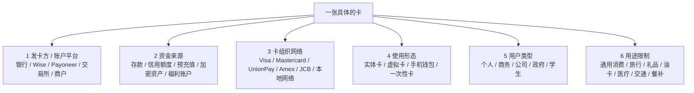

# 市面上所有常见“卡”的分类图谱

> 本页面不是列举每一家银行的每一张卡，而是给出“卡”的完整分类框架：按资金来源、卡组织网络、使用形态、持卡人类型、地域网络和特殊用途来理解。最后核验日期：2026-04-23。

---

## 一句话结论

**“卡”不是一种东西，而是多层标签的组合。** 一张卡通常同时具备：

```text
发卡品牌 / 账户平台 + 资金来源 + 卡组织网络 + 使用形态 + 用户类型 + 地区规则
```

例如：

- **Wise Mastercard 借记卡** = Wise 账户 + Wise 多币种余额 + Mastercard 网络 + 实体/虚拟卡。
- **Chase Visa 信用卡** = Chase 发卡 + 银行信用额度 + Visa 网络 + 个人信用卡。
- **Payoneer Commercial Mastercard** = Payoneer 账户 + 商业余额 + Mastercard 网络 + 商务支出卡。
- **Bybit Card** = 加密交易所账户 + 法币/加密余额转换 + Visa/Mastercard 网络 + 加密消费卡。
- **银联借记卡** = 中国银行账户 + 活期余额 + UnionPay 网络 + 本地借记卡。

---

## 1. 总图：一张卡的六层结构



判断一张卡时，不要只看卡面 logo。更应该问：

1. **谁给你发的卡？**
2. **钱从哪里扣？**
3. **走哪条网络？**
4. **能不能线上 / 线下 / ATM / Apple Pay？**
5. **是个人卡、商务卡还是政府 / 福利卡？**
6. **有没有商户类别、地区或币种限制？**

---

## 2. 按资金来源分类

这是最重要的分类，因为它决定“你是在花自己的钱、借银行的钱，还是花预存/专用账户的钱”。

| 类型 | 资金来源 | 典型例子 | 核心特点 | 主要风险 |
|---|---|---|---|---|
| 借记卡 Debit Card | 银行活期 / 支票账户余额 | 招行借记卡、Chase Debit、HSBC Debit | 直接扣账户余额，可 ATM | 账户余额不足、盗刷、跨境费 |
| 信用卡 Credit Card | 银行授信额度 | Visa / Mastercard / Amex 信用卡 | 先消费后还款，可积分 / 分期 | 高利息、逾期、过度消费 |
| 签账卡 Charge Card | 发卡方短期授信，通常需全额还款 | Amex 传统签账卡 | 不是典型循环信用，常服务高消费 / 商旅 | 需全额还款，费用较高 |
| 预付卡 Prepaid Card | 先充值后消费 | 旅行预付卡、通用 reloadable card | 不依赖银行账户或信用 | 费用复杂、保护弱于银行账户 |
| 礼品卡 Gift Card | 预存固定金额 | Amazon / Apple / 商场礼品卡 | 送礼、单商户或多商户消费 | 过期、丢失、诈骗 |
| 工资卡 / Payroll Card | 雇主发薪到卡账户 | 美国 payroll card | 给没有银行账户的员工发工资 | 取现和查询费用 |
| 政府福利卡 / EBT | 政府福利资金 | SNAP / EBT、补助卡 | 专款专用、商户类别限制 | 用途受限、资格审查 |
| 医疗账户卡 | HSA / FSA 等医疗账户 | 美国 HSA/FSA debit card | 医疗支出税优 | 非合格消费需纠正 / 罚税 |
| 加密卡 Crypto Card | 交易所余额、稳定币、加密资产变现 | Bybit / Coinbase / Crypto.com Card | 用加密资产包装成卡消费 | 税务复杂、币价波动、交易所风险 |
| 多币种余额卡 | 多币种法币余额 | Wise / Revolut / YouTrip | 跨境消费和换汇 | 地区可用性、ATM / 押金限制 |

---

## 3. 按卡组织 / 支付网络分类

卡组织负责交易路由、授权、清算、争议规则和受理网络。它不是一定负责发卡或放贷。

| 网络 / 品牌 | 主要区域 | 常见卡类型 | 备注 |
|---|---|---|---|
| Visa | 全球 | 借记、信用、预付、商务 | 四方模式代表之一，全球接受度高 |
| Mastercard | 全球 | 借记、信用、预付、商务 | 与 Visa 类似，另有 Maestro / Cirrus 历史网络 |
| Maestro | 欧洲 / 传统借记场景 | 借记卡 | Mastercard 旗下借记品牌；很多市场逐步迁移到 Mastercard Debit |
| Cirrus | 全球 ATM 网络 | ATM / 借记取现 | Mastercard 旗下 ATM 网络，不等于完整消费卡 |
| Visa Plus | 全球 ATM 网络 | ATM / 借记取现 | Visa 旗下 ATM 网络 |
| UnionPay / 银联 | 中国 + 全球受理 | 借记、信用、预付 | 中国本地覆盖强，海外受理取决于商户和 ATM |
| American Express / Amex | 全球高端和商旅强 | 信用、签账、商务 | 常见 closed-loop / 三方模式叙事，也有合作发卡 |
| Discover | 美国强，全球通过 Discover Global Network | 信用、借记、预付 | Diners Club 属于其全球网络体系 |
| Diners Club | 商旅 / 国际网络 | 信用、签账 | 历史悠久，现多纳入 Discover 网络 |
| JCB | 日本强，亚洲旅游网络 | 信用、借记、预付 | 日本本土强，亚洲商旅场景常见 |
| RuPay | 印度 | 借记、信用、预付 | NPCI 推出的印度本地卡网络 |
| Interac | 加拿大 | 借记 / 本地支付 | 加拿大本地 debit 网络 |
| eftpos | 澳大利亚 | 借记 / 本地支付 | 澳大利亚本地卡支付网络 |
| girocard | 德国 | 借记 / 本地支付 | 德国本地银行卡网络 |
| Cartes Bancaires / CB | 法国 | 借记 / 信用联名 | 法国本地卡网络，常与 Visa/Mastercard 联名 |
| Bancontact | 比利时 | 借记 / 本地支付 | 比利时本地强势网络 |
| Dankort | 丹麦 | 借记 / 本地支付 | 丹麦本地网络，常与 Visa 联名 |
| mada | 沙特 | 借记 / 本地支付 | 沙特本地支付网络 |
| Mir | 俄罗斯 | 借记 / 本地支付 | 受制裁和地缘政治影响，国际受理有限 |
| Elo | 巴西 | 信用 / 借记 / 预付 | 巴西本地卡品牌 |
| Troy | 土耳其 | 借记 / 信用 / 预付 | 土耳其本地卡网络 |

关键区别：

```text
Visa / Mastercard / UnionPay / Amex = 交易走哪条网络
银行 / Wise / Payoneer / Bybit = 谁给你账户和卡
Debit / Credit / Prepaid = 钱从哪里来
```

---

## 4. 按使用形态分类

| 形态 | 本质 | 典型用途 | 注意事项 |
|---|---|---|---|
| 实体卡 Physical Card | 塑料 / 金属卡，有芯片、磁条、NFC | 线下消费、ATM | 丢失和盗刷风险 |
| 虚拟卡 Virtual Card | 只有数字卡号，无实体卡 | 网购、SaaS、订阅 | 不能插卡或 ATM |
| 数字卡 Digital Card | App 内即时生成 / 显示卡信息 | 立即线上付款 | 与虚拟卡边界因产品而异 |
| 一次性卡 Disposable Card | 每次或短期更换卡号 | 高风险商户、试用订阅 | 退款和续费可能复杂 |
| 手机钱包卡 Tokenized Card | Apple Pay / Google Pay / Samsung Pay token | 线下 tap、App 内支付 | 手机钱包不是发卡方 |
| 可穿戴支付卡 | 手表 / 手环 / 戒指 token | 运动、交通、快速支付 | 依赖设备和地区支持 |
| ATM-only Card | 只可取现 / 查询 | 老式银行 ATM 卡 | 不能通用消费 |
| Contactless-only / Transit Card | NFC 交通或小额支付 | 地铁、公交、校园 | 通常闭环或半闭环 |

---

## 5. 按持卡人和账户性质分类

| 类型 | 面向谁 | 常见代表 | 特点 |
|---|---|---|---|
| 个人卡 Consumer Card | 个人消费者 | 普通借记 / 信用 / Wise / Revolut | 日常消费、旅行、网购 |
| 学生卡 Student Card | 学生 | 学生信用卡、校园卡 | 额度低、教育和身份绑定 |
| 青少年 / 儿童卡 Teen / Kids Card | 未成年人和家庭 | GoHenry、Revolut <18 | 家长控制、限额、教育 |
| 商务卡 Business Card | 个体户、小公司 | Wise Business、Payoneer、Amex Business | 公司开支、员工卡、账务 |
| 公司卡 Corporate Card | 中大型企业 | Brex、Ramp、Airwallex、银行公司卡 | 费用管理、审批、对账 |
| 采购卡 Purchasing Card / P-Card | 企业采购部门 | 银行 P-card | B2B 采购、商户类别限制 |
| 车队 / 油卡 Fleet / Fuel Card | 物流、车队 | WEX、Shell Fleet | 加油、维修、司机管理 |
| 政府 / 福利卡 Government Card | 政府项目受益人 | EBT、补助卡 | 专款专用、资格审查 |
| 商户会员卡 / Store Card | 商户客户 | Amazon、Costco、百货商店卡 | 返利强但用途窄 |

---

## 6. 按用途和场景分类

| 场景卡 | 代表 | 解决什么问题 | 限制 |
|---|---|---|---|
| 旅行卡 | Wise、Revolut、YouTrip | 多币种、低换汇成本、海外消费 | 押金和 ATM 规则需注意 |
| 航司 / 酒店联名卡 | Amex Platinum、Chase Sapphire、航空联名卡 | 里程、酒店权益、保险 | 年费高、积分规则复杂 |
| 现金返还卡 | Citi Double Cash、Apple Card 等 | 简单返现 | 跨境和类别规则不同 |
| 余额转移卡 | 0% APR balance transfer cards | 降低信用卡利息 | 转账费、优惠期后高利率 |
| Secured Credit Card | 押金担保信用卡 | 建立 / 修复信用记录 | 需押金、额度低 |
| Store / Private Label Card | 商户自有卡 | 店内分期和返利 | 只能在特定商户或生态使用 |
| Gift Card | 礼品卡 | 送礼、预算隔离 | 诈骗高发、退款难 |
| Transit Card | Oyster、Octopus、Suica | 交通、小额支付 | 地域和生态限制 |
| Campus Card | 校园一卡通 | 食堂、门禁、打印 | 校内闭环 |
| Meal / Voucher Card | 餐补卡、Sodexo 等 | 员工福利、餐饮补贴 | 商户类别限制 |
| Healthcare Card | HSA / FSA 卡 | 医疗税优支出 | 必须合格医疗用途 |
| Gaming / Teen Spending Card | 游戏 / 青少年卡 | 限额、家长控制 | 使用范围窄 |
| Crypto Card | Bybit / Coinbase / Crypto.com | 加密资产日常消费 | 税务和监管复杂 |

---

## 7. 按发卡主体分类

| 发卡主体 | 例子 | 他们真正提供什么 |
|---|---|---|
| 传统银行 | Chase、HSBC、招行、工行 | 存款账户、信用额度、合规、卡发行 |
| 信用卡公司 / 网络型发卡方 | Amex、Discover | 卡网络、发卡、商户网络、奖励体系 |
| Fintech / Neobank | Wise、Revolut、N26、Monzo、Chime | App 体验、账户包装、换汇、预算管理 |
| 跨境收款平台 | Payoneer、Airwallex | 多币种收款、B2B 支付、商业卡 |
| 加密交易所 | Bybit、Coinbase、Crypto.com | 加密资产余额、法币转换、返现权益 |
| 商户 / 平台 | Amazon、Apple、Costco | 生态内返利、会员绑定、消费闭环 |
| 政府 / 雇主 / 学校 | EBT、Payroll、Campus Card | 特定资金发放和用途控制 |
| BIN sponsor / 发卡处理商 | Marqeta、Lithic、Adyen Issuing 等 | 帮品牌方发卡、处理授权、合规接口 |

很多现代卡的实际结构是：

```text
前台品牌（Wise / X 平台）
+ 持牌发卡机构或 EMI
+ BIN sponsor / issuer processor
+ Visa / Mastercard 等网络
+ 收单方 / 商户
```

所以你看到的品牌不一定是法律上的发卡行。

---

## 8. 开环、闭环、半闭环

| 类型 | 含义 | 例子 |
|---|---|---|
| 开环卡 Open-loop | 可在广泛商户网络使用 | Visa / Mastercard / UnionPay 卡 |
| 闭环卡 Closed-loop | 只能在一个商户或生态使用 | Starbucks Card、校园卡、部分礼品卡 |
| 半闭环卡 Semi-closed-loop | 可在一组商户 / 类别使用 | 餐补卡、交通卡、商场卡 |

Wise 卡、银行信用卡、Bybit Card 通常属于开环卡；星巴克卡、单商户礼品卡、校园卡更接近闭环。

---

## 9. 对新手最实用的选择框架

### 本地生活

- 本地银行借记卡：工资、缴费、ATM、日常基础。
- 本地信用卡：信用记录、积分、押金、大额消费保护。
- 手机钱包：把本地卡 token 化，提高便利性。

### 出国旅行 / 海外网购

- Wise / Revolut / YouTrip：多币种和换汇。
- 一张 Visa + 一张 Mastercard：降低单网络失效风险。
- 信用卡：酒店、租车、押金、保险。

### 跨境收款 / 自由职业

- Wise：个人和小团队跨境收款、换汇、消费。
- Payoneer：平台收款、跨境电商、广告费和商业支出。
- 本地银行账户：税务、长期储蓄和本地合规。

### 企业开支

- Business card：小公司和个体户开支。
- Corporate card：团队审批、限额、报销、SaaS 管理。
- P-card / Fleet card：采购和车队专项管理。

### 加密资产消费

- 交易所卡：把交易所余额接入日常消费。
- 稳定币卡：减少币价波动，但仍有交易所和监管风险。
- 税务记录：每笔消费可能是资产处置。

---

## 10. 卡面 logo 怎么读

一张卡面可能同时出现多个标志：

```text
银行 / Wise / Payoneer / 交易所 logo = 谁提供账户和客户关系
Visa / Mastercard / UnionPay / Amex / JCB = 走哪条受理网络
Debit / Credit / Prepaid / Business = 资金和产品类型
Contactless 标志 = 支持 NFC
Apple Pay / Google Pay = 可加入手机钱包
Plus / Cirrus = ATM 网络标志
本地网络标志（CB / girocard / Interac / eftpos）= 本地收单网络
```

例如：

- **Wise + Mastercard Debit**：Wise 多币种余额，走 Mastercard 借记网络。
- **Bank + Visa Credit**：银行信用额度，走 Visa 网络。
- **Bank + girocard + Mastercard**：德国本地网络 + 国际联名网络。
- **UnionPay Debit**：银联借记网络，本地银行账户扣款。
- **Amex Platinum**：Amex 发卡和网络，高端签账 / 信用权益。

---

## 11. 风险与费用维度

| 维度 | 需要检查什么 |
|---|---|
| 年费 | 信用卡、商务卡、高端旅行卡常见 |
| 外币交易费 | 传统银行信用卡 / 借记卡常见 |
| ATM 费 | 发卡方、ATM 运营商、跨境网络都可能收费 |
| 利息 | 信用卡循环欠款和现金预借最贵 |
| 预授权 | 酒店、租车、加油站可能冻结资金 |
| 退款 | 虚拟卡、一次性卡、礼品卡退款更复杂 |
| 争议 / 拒付 | 信用卡通常强于借记 / 预付 |
| 账户审查 | 跨境、加密、大额交易更容易触发 |
| 税务 | 加密卡消费、信用卡奖励、商务支出可能有税务影响 |
| 地区限制 | 发卡资格、寄送、卡网络和商户受理都可能受限 |

---

## 12. 总结：市面上的卡可以这样归档

```text
按资金来源：借记卡 / 信用卡 / 签账卡 / 预付卡 / 礼品卡 / 福利卡 / 加密卡
按网络：Visa / Mastercard / Maestro / UnionPay / Amex / JCB / Discover / 本地网络
按形态：实体卡 / 虚拟卡 / 数字卡 / 一次性卡 / 手机钱包 token / ATM-only
按用户：个人卡 / 学生卡 / 青少年卡 / 商务卡 / 公司卡 / 政府卡
按用途：旅行卡 / 返现卡 / 航司酒店卡 / 油卡 / 医疗卡 / 交通卡 / 校园卡 / 餐补卡
按开放性：开环卡 / 闭环卡 / 半闭环卡
```

最短记法：

```text
Wise、银行、Bybit、Payoneer = 谁给你卡
Debit、Credit、Prepaid、Crypto = 钱从哪里来
Visa、Mastercard、Maestro、UnionPay = 交易走哪条路
实体、虚拟、Apple Pay = 你用什么形态付款
```

---

## 13. 官方来源

- [CFPB: Prepaid cards](https://www.consumerfinance.gov/consumer-tools/prepaid-cards/)
- [CFPB: Credit cards](https://www.consumerfinance.gov/consumer-tools/credit-cards/)
- [Visa: Accept Visa payments](https://usa.visa.com/run-your-business/accept-visa-payments.html)
- [Mastercard Newsroom: Maestro retires](https://newsroom.mastercard.com/news/europe/en/perspectives/en/2021/blog-from-valerie-nowak-why-this-maestro-is-retiring-after-30-years/)
- [Mastercard ATM locator: Mastercard / Maestro / Cirrus](https://www.mastercard.com/us/en/personal/get-support/atm-near-me.html)
- [UnionPay International](https://www.unionpayintl.com/en/)
- [American Express Global Network](https://network.americanexpress.com/globalnetwork/v4/partners/acquirers/power-of-the-network/)
- [Discover Global Network](https://www.discoverglobalnetwork.com/)
- [JCB Global](https://www.global.jcb/en/)
- [RuPay](https://www.rupay.co.in/)
- [Interac](https://www.interac.ca/en/consumers/products/interac-debit/)
- [eftpos Australia](https://www.eftposaustralia.com.au/)
- [girocard](https://www.girocard.eu/)
- [Cartes Bancaires](https://www.cartes-bancaires.com/)
- [Bancontact Payconiq](https://www.bancontact.com/)
- [Dankort](https://www.dankort.dk/)
- [mada](https://www.mada.com.sa/)
- [Elo](https://www.elo.com.br/)
