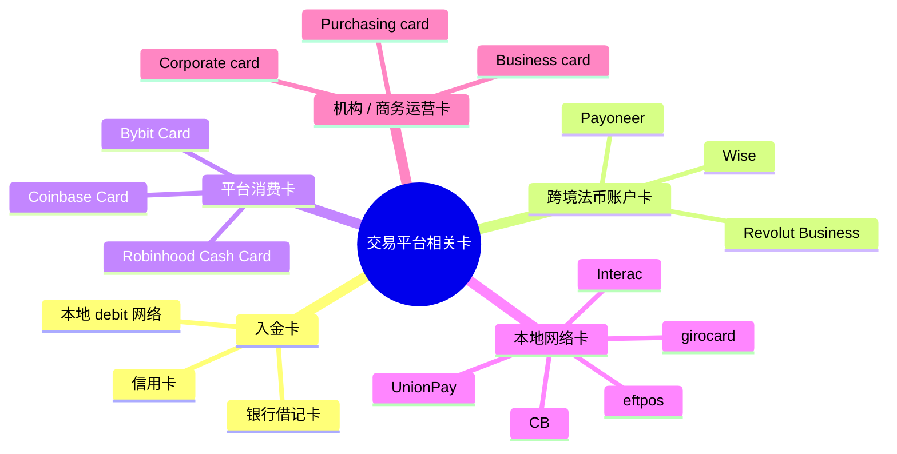

# 交易平台视角下的卡分类

> 本页不是消费金融百科，而是把和 trading platforms atlas 相关的“卡”重新归档：哪些卡是入金通道，哪些卡是跨境法币工具，哪些卡是留存产品，哪些只是背景噪音。最后核验日期：2026-04-23。

---

## 一句话结论

**对交易平台来说，卡最重要的分类不是“好不好刷”，而是“这张卡能不能安全、高效地把钱打进账户，再合法地打出来”。**

所以本项目真正需要的分类框架是：

```text
入金卡
+ 跨境法币账户卡
+ 平台消费卡
+ 本地网络卡
+ 机构 / 商务运营卡
```

而不是把所有礼品卡、校园卡、交通卡都当主线内容。

---

## 1. 五类与项目最相关的卡



---

## 2. 入金卡：最重要的零售资金入口

### 这类卡包括什么

- 银行借记卡
- 部分信用卡
- 本地 debit 网络联名卡
- 某些支持 3DS 的国际卡

### 为什么它们重要

- 是零售用户第一次入金最自然的路径。
- 比银行电汇更快。
- 比 ACH / SEPA 等清算周期更短。
- 对加密所尤其关键：用户可以即时买币。

### 为什么平台又爱又怕

| 优点 | 缺点 |
|---|---|
| 转化高 | 手续费高 |
| 到账快 | chargeback 风险高 |
| 用户门槛低 | 欺诈 / 盗卡风险高 |
| 适合小额首充 | 大额资金效率差 |

### 研究结论

对平台来说，卡入金是一条 **获客友好、风控痛苦** 的通道。

---

## 3. 跨境法币账户卡：Wise / Payoneer / Revolut Business

这类卡不一定是主入金通道，但对跨境用户和平台外围生态很重要。

### 它们解决什么问题

- 多币种余额管理
- 跨境收款
- 换汇
- 海外广告费 / SaaS / 小额运营支付
- trader / affiliate / freelancer 的跨境周转

### 这类卡的共同特点

- 卡只是账户的延伸，不是核心清算基础设施。
- 更像“平台外围法币工具”，不是撮合或托管层。
- 在不同地区被交易平台接受程度不一致。

### 内部差异

| 产品 | 更适合谁 | 项目里的定位 |
|---|---|---|
| Wise | trader / freelancer / small operator | 个人级跨境法币工具 |
| Payoneer | seller / affiliate / business operator | 平台商家和商业支出工具 |
| Revolut Business | 欧洲和国际化团队 | 新银行式企业资金工具 |

---

## 4. 平台消费卡：Coinbase Card / Bybit Card / Robinhood Cash Card

这类卡和“入金卡”不是一回事。

### 它们真正做什么

- 把平台余额变成可消费余额；
- 让用户把钱留在平台内；
- 提高日活、余额留存和钱包化程度。

### 为什么交易平台会发自己的卡

| 商业目的 | 含义 |
|---|---|
| 提高留存 | 用户不急着把钱提走 |
| 扩展场景 | 从交易延伸到消费 |
| 增加收入 | interchange / 合作收益 / 会员权益 |
| 账户中心化 | 把平台变成用户主钱包之一 |

### 项目里的意义

这类卡不是交易基础设施，而是 **平台商业模式向现金管理延伸** 的信号。

---

## 5. 本地网络卡：决定不同国家的真实入金效率

很多研究只写 Visa / Mastercard，但真实世界里，本地网络常常决定支付成功率。

### 典型网络

- 中国：**UnionPay**
- 加拿大：**Interac**
- 德国：**girocard**
- 澳大利亚：**eftpos**
- 法国：**Cartes Bancaires (CB)**
- 比利时：**Bancontact**
- 丹麦：**Dankort**

### 为什么它们重要

- 本地收单成功率更高；
- 费用结构和国际卡不同；
- 有些国家 debit 主体根本不是 Visa / Mastercard；
- 平台如果只接国际网络，可能会损失本地用户。

### 对 atlas 的启发

交易平台的“支付能力”不能只看 API 和撮合，还要看：

```text
它在每个国家接了什么本地支付网络
```

---

## 6. 机构 / 商务运营卡：平台自己也要花钱

交易平台不只是收用户钱，也要自己付款。

### 常见场景

- 广告投放
- 云服务 / SaaS
- 差旅
- 外包和供应商付款
- 市场活动

### 常见卡型

- Business card
- Corporate card
- Purchasing card (P-card)
- Commercial debit / prepaid card

### 为什么纳入项目

因为很多新平台的运营能力，本质上是：

- 有没有全球支付能力；
- 能不能高效付广告费；
- 能不能给全球团队和供应商打钱；
- 能不能做多币种企业财务。

这和纯交易技术同样影响平台扩张速度。

---

## 7. 信用卡、借记卡、预付卡：在项目里的正确权重

### 借记卡

- 最重要的零售入金卡。
- 和银行账户路径最接近。
- 退款到原路径更自然。

### 信用卡

- 可做入金，但风控压力更大。
- 在 crypto 场景常被视作 cash advance / quasi-cash 风险。
- 平台常限制国家、BIN、额度和产品范围。

### 预付卡

- 对某些小额场景可用；
- 但在交易平台里通常不是优先主路径；
- 接受度和风控友好度弱于传统借记卡。

结论：

```text
交易平台研究里，
借记卡 > 信用卡 > 预付卡
```

---

## 8. 低相关卡型：知道存在即可

以下卡型真实存在，但不该占 atlas 主要篇幅：

- 礼品卡
- 校园卡
- 交通卡
- 餐补卡
- 游戏卡
- 医疗福利卡

它们更适合放在“支付行业背景噪音”，而不是 trading platform 主线。

---

## 9. 这个分类如何服务本项目

如果后续继续写平台、架构和关系图，卡应该被放进这些主题：

### 1）平台入金能力

- 支持哪些卡网络；
- 支持 debit 还是 credit；
- 即时到账还是延迟可用；
- 哪些地区受限。

### 2）平台出金和退款逻辑

- 是否退回原卡；
- 利润是否需走银行转账；
- AML / fraud rules 怎么设。

### 3）跨境法币工具层

- Wise / Payoneer / 本地银行在用户侧扮演什么角色；
- 平台对这些工具的接受度和限制。

### 4）平台商业模式延伸

- 是否发自己的 debit card / cash card；
- 是否试图成为钱包和现金管理入口。

---

## 10. 最后的最短记法

```text
借记卡 / 信用卡 = 用户怎么入金
Wise / Payoneer = 用户怎么跨境周转法币
Visa / Mastercard / UnionPay / 本地网络 = 平台接哪条支付路
Coinbase Card / Bybit Card / Robinhood Cash Card = 平台怎么把余额变成消费工具
Business / Corporate card = 平台自己怎么花钱
```

---

## 11. 官方来源

- [Wise Card](https://wise.com/card/)
- [Payoneer Commercial Mastercard](https://www.payoneer.com/solutions/payoneer-commercial-card/)
- [Bybit — Bank Card Terms of Use](https://www.bybit.com/en/help-center/article/?id=000001639)
- [Bybit Card](https://www.bybit.com/en/help-center/article/Bybit-Card-Introduction)
- [Coinbase Card — Use your Coinbase debit card](https://help.coinbase.com/coinbase/trading-and-funding/coinbase-card/use-cb-card)
- [Robinhood — Robinhood Cash Card](https://robinhood.com/us/en/support/articles/robinhood-cash-card/)
- [UnionPay International](https://www.unionpayintl.com/en/)
- [Interac Debit](https://www.interac.ca/en/payments/personal/pay-with-interac-debit/)
- [girocard](https://www.girocard.eu/)
- [eftpos Australia](https://www.eftposaustralia.com.au/)
- [Cartes Bancaires](https://www.cartes-bancaires.com/)
- [Bancontact](https://www.bancontact.com/)
- [Dankort](https://dankort.dk/)
